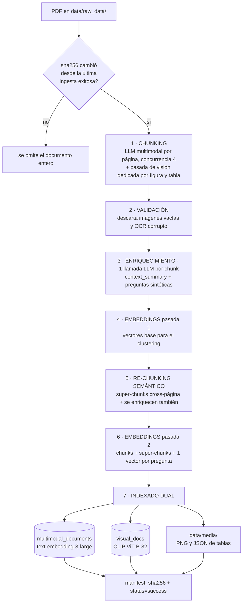
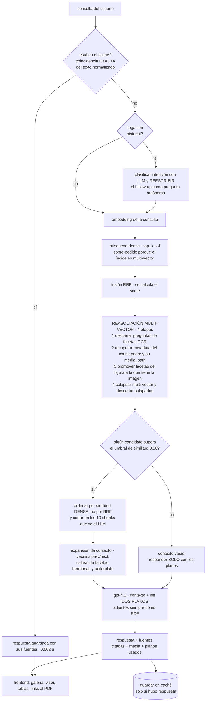

# 🚀 Sistema RAG Multimodal para Documentación Técnica

Pipeline completo de ingesta inteligente con indexado dual (texto + visual) optimizado para documentación técnica industrial.

## ✨ Características Principales

### 🎯 Mejoras 2026
- **💰 Chunking Híbrido (60-80% ahorro):** análisis automático de complejidad → sintáctico (gratis) o LLM (costoso). **Desactivado por defecto** (`use_hybrid_chunking=false`): se prioriza calidad, ver "Enriquecimiento por LLM"
- **📊 Split Inteligente de Tablas:** Divide tablas grandes preservando headers y contexto
- **⚡ Diagramas Multi-Faceta:** 2 facetas por figura — visual (descripción de visión + CLIP + imagen) y OCR (solo si es legible). La tercera faceta se eliminó: era texto idéntico a la visual, 13% del índice
- **🗂️ Metadata Jerárquica:** Extracción automática de TOC, secciones y capítulos
- **🔬 Validación Técnica:** 4 validadores especializados para documentación de ingeniería
- **🔗 Re-chunking Semántico:** Super-chunks que agrupan contenido relacionado multi-página

### 🚨 Fixes Mayo 2026 - PDFs Escaneados
- **🔧 OCR Preprocessing Pipeline:** Deskew + binarización + denoise + resize a 300 DPI
- **📈 OCR Confidence:** 0% → 82.36% en planos escaneados. Ojo: confianza alta no es texto legible — de 98 chunks OCR del corpus, solo 7 pasan el chequeo de legibilidad
- **🎯 Detección Robusta de Diagramas:** Fix is_diagram() para acceder metadata correctamente
- **✨ Multi-Faceta Operativo:** los chunks de figura llegan al índice (antes se descartaban en silencio por `content_type` no reconocido)
- **🔍 Retrieval Coverage:** 33% → 100% en planos técnicos escaneados

### 📊 Lo que está medido (y lo que no)

Todo se mide con `eval/run_eval.py` (54 consultas parafraseadas en voz de técnico + 5
fuera de tema), corriendo el pipeline REAL de la API.

| Métrica | Índice actual | Qué mide |
|---|---|---|
| **respuesta presente en el texto recuperado** | **95.3%** (41/43) | que el LLM RECIBA el dato, no solo la página. Independiente del chunking |
| recall@10 por página | 81.5% | que alguna página correcta esté en el top-10 |
| recall@1 por página | 61.1% | ídem |
| MRR | 0.681 | ídem |
| llegan al top-10 SIN la respuesta | 0 | el falso positivo que el recall por página no ve |
| gate de consultas fuera de tema | 5/5 | 5 consultas sin relación con el corpus |
| integridad de media | 271/271 | cada `media_path` del índice existe en disco |

**La métrica de arriba es la que importa, y hay una razón concreta.** El recall por página
cuenta como acierto un chunk de la página correcta que NO trae el dato. Medido sobre los 17
códigos de fallo del manual: 16 de 17 "llegaban" por página, pero solo 8 traían la fila que
explica esa falla — el resto devolvía otra parte de la misma tabla. Para el técnico que
preguntó "me tira F048, qué hago", eso es un fallo completo.

`eval/answer_check.py` lo verifica con la `answer_key` de cada entrada: busca anclas
(códigos como `P101`/`F048`, valores con unidad como `216 mm`) y, si no hay, cae a
solapamiento de palabras. **11 de las 54 claves se declaran no verificables y se excluyen**
(`"0"`, `"2"`, `"50"`: un dígito suelto "aparece" en cualquier texto) — se informa el
denominador real en vez de inflar el número.

**Ojo con comparar dos ingestas.** El chunking usa LLM y no es determinista: dos corridas
sobre el mismo PDF cortan las páginas distinto. Como el eval se genera a partir de un
índice, queda sesgado a favor de ese índice. Medido: entre dos ingestas, el 33% de los
`chunk_id` del gold dejaron de existir y el 48% de los textos fuente ya no estaban en su
página, y eso solo bastaba para mover el recall@10 de 90.7% a 70.4%.

Se mitigó una parte: el gold ahora se ancla a **páginas reales del PDF** en vez de a
rangos de super-chunk (`"55-56"`), que cambian con cada corrida. Eso recuperó 11 puntos
en la ingesta medida como peor. Lo que falta para que el eval sea comparable de verdad es
la revisión humana: confirmar, pregunta por pregunta, que la página del gold es correcta.
`eval/triage_eval_set.py` prioriza esa revisión marcando 15 de 54 con alertas objetivas.

**Qué comparaciones SÍ son válidas.** Todo lo medido *dentro* de un mismo índice, con solo
la config cambiando (`--variant`): el reranker, el umbral de relevancia, BM25, CLIP, la
cantidad de preguntas sintéticas. Son las decisiones de las secciones de Retrieval
Avanzado y siguen en pie.

**Sin medir:** el retrieval visual por CLIP con consultas realmente visuales (ver sección
10) y el impacto de subir las preguntas sintéticas por encima de 5.

### 🎨 Sistema Dual + Retrieval Avanzado
- **Índice Textual (OpenAI):** text-embedding-3-large para texto narrativo y tablas
- **Índice Visual (CLIP):** ViT-B-32 para búsqueda semántica real de imágenes por contenido visual
- **Fusión Híbrida (RRF):** se calcula, pero **el orden final lo decide la similitud densa** — ordenar por RRF se midió peor (87.0% vs 88.9%). El índice visual está desactivado: ver Retrieval Avanzado

### ⚡ Retrieval: 6 técnicas evaluadas, 3 desactivadas por medición
- **🎯 Cross-Encoder Reranking:** **desactivado** — medido, en esta configuración expulsa del top-10 el chunk correcto más veces de las que lo rescata (ver Retrieval Avanzado)
- **🔍 BM25 Sparse Retrieval:** **desactivado** — medido, no aporta nada en este corpus (ver Retrieval Avanzado)
- **📖 Context Expansion:** Chunks previos/siguientes automáticos
- **🔄 Query Expansion:** **no implementada** — el índice multi-vector ya cubre la paráfrasis (ver Retrieval Avanzado)
- **📍 Metadata Filters:** Filtrado por capítulo/sección/tipo
- **🗂️ Hierarchical Metadata:** Navegación estructurada en resultados

---

## 📦 Instalación Rápida

```bash
# 1. Clonar y navegar al proyecto
cd Ingestion

# 2. Crear entorno virtual
python3 -m venv .venv
source .venv/bin/activate

# 3. Instalar dependencias
pip install -r requirements.txt

# 4. Configurar API key
nano .env  # Añadir OPENAI_API_KEY

# 5. Validar instalación
python scripts/validate_improvements.py
```

**Dependencias clave:** PyMuPDF 1.23.5, OpenAI 1.109.1, LangChain 0.3.27, ChromaDB 1.0.21, sentence-transformers 2.5.1, scikit-learn 1.7.2, rank-bm25 0.2.2, thefuzz 0.20.0, opencv-python 4.10.0.84 (OCR preprocessing)

---

## 🚀 Uso en 3 Pasos

### 1. Colocar PDFs

```bash
cp tus_manuales_tecnicos/*.pdf data/raw_data/
```

### 2. Ejecutar Pipeline

```bash
source .venv/bin/activate
python src/main_multimodal.py
```

**Output esperado:**
```
🔧 Procesando: variadorPowerFlex4M
━━━━━━━━━━━━━━━━━━━━━━━━━━━━━━━━━━━━━━

📄 Chunking con estrategia híbrida...
  Página 1/50: Complejidad: 0.12 | Estrategia: syntactic ← 🆓 GRATIS
  Página 2/50: Complejidad: 0.78 | Estrategia: llm      ← 💰 $0.03
  
  ⚡ Diagrama mejorado → 3 chunks multi-faceta
  📊 Tabla dividida → 5 partes

ESTADÍSTICAS DE CHUNKING
═════════════════════════════════════
Total páginas:           50
Páginas sintácticas:     35 (70.0%)  ← 70% ahorro!
Páginas con LLM:         15 (30.0%)
Diagramas procesados:    8
Tablas divididas:        3
Total chunks:            127
Ahorro estimado:         70.0% (~$1.05)

🔬 Validación técnica de chunks...
   ✅ Chunks válidos: 123/127 (96.8%)

🔗 Re-chunking semántico...
   ✅ Super-chunks creados: 4
```

### 3. Búsqueda Híbrida

```bash
python scripts/hybrid_multimodal_search.py "diagrama de conexiones del motor"
```

**Resultado:**
```
🔍 BÚSQUEDA: "diagrama de conexiones del motor"
━━━━━━━━━━━━━━━━━━━━━━━━━━━━━━━━━━━━━━━━━━━━━

→ Buscando en índice textual... ✓ 15 resultados
→ Buscando en índice visual...  ✓ 5 resultados
→ Fusionando con RRF...         ✓ 5 resultados finales

📊 RESULTADOS
━━━━━━━━━━━━━━━━━━━━━━━━━━━━━━━━━━━━━━━━━━━━━

1. 🖼️  Score: 0.042 | [TEXT+VISUAL]
   Tipo: diagram_visual
   Documento: variadorPowerFlex4M.pdf
   Página: 36
   Sección: Chapter 3: Wiring
   🖼️  Imagen: data/media/images/.../diagram.png
   Componentes: motor:M1, contactor:K2, relay:F1
   Valores: 480V AC, 12A, 5.5kW
```

---

## 📥 Qué se ingesta

Los PDF viven en `data/raw_data/`. El corpus actual son 5 documentos de naturaleza muy
distinta, y eso importa porque cada tipo estresa una parte diferente del pipeline:

| Documento | Qué es | Chunks | Preguntas |
|---|---|---|---|
| `variadorPowerFlex4M.pdf` | manual del variador (119 pág.): tablas de parámetros, códigos de falla, diagramas de cableado | 430 | 1878 |
| `Tesis 06-2025.docx.pdf` | tesis del secadero: proceso, mediciones, código Python, fotos de la máquina | 195 | 853 |
| `TBEN-L4-8IOL_catalog.pdf` | catálogo del módulo de E/S (en inglés): especificaciones y pinouts | 41 | 174 |
| `conexionadoTben.pdf` | plano de conexionado del TBEN (1 hoja, escaneada) | 2 | 5 |
| `Plano distribucion electrica.pdf` | plano eléctrico principal (escaneado) | 2 | 5 |
| **Total** | | **670** | **2915** |

Eso da **3585 vectores** en el índice textual (`multimodal_documents`) y **110** en el
visual (`visual_docs`), más **271 archivos de media** (imágenes y JSON de tablas) en
`data/media/`.

Los dos planos rinden solo 2 chunks cada uno porque son hojas escaneadas: casi todo su
contenido es gráfico. **No se recuperan por similitud** — se adjuntan SIEMPRE al LLM como
PDF (ver `ELECTRIC_DIAGRAM_RELATED_FILES` en `API/configs/Configuration.py`), que es la
única forma de que un modelo de visión los interprete de verdad.

### Qué le pasa a cada tipo de contenido

El LLM multimodal clasifica cada parte de la página y de ahí sale un `content_type`. Lo que
viene después es distinto para cada uno:

| Tipo | Se le genera descripción con LLM | Qué se vectoriza | Índices | Media en disco |
|---|---|---|---|---|
| **Texto** | no, ya es texto | `context_summary` + el texto | textual | — |
| **Tabla** | no, se preserva la estructura | el markdown de la tabla | textual | JSON con `markdown` + `json.rows` + `searchable_text` |
| **Figura / diagrama** | **sí**, pasada de visión dedicada por recorte | la descripción generada | textual **+ CLIP** | PNG del recorte |
| **OCR de figura** | no, es texto extraído | las etiquetas leídas del plano | textual | — (comparte el PNG) |
| **Super-chunk** | no, concatena a sus hijos | `context_summary` + el texto unido | textual | — |

Los cuatro primeros salen del chunking; el super-chunk se crea después, agrupando por
similitud semántica real entre chunks (cross-página).

**Las figuras y las tablas grandes reciben una pasada de visión aparte.** No alcanza con lo
que el LLM dijo al ver la página completa: se recorta la figura por su bbox y se manda ese
recorte solo, con un prompt específico. Una descripción hecha mirando la página entera
tiende a ser vaga ("un diagrama eléctrico"); mirando solo el recorte sale
"las conexiones de un variador, con terminales de entrada y salida y opciones SNK/SRC".

**Todo chunk de contenido pasa por lo mismo después**, sin importar el tipo:

1. **Validación** — se descarta lo inservible. Incluye las imágenes que el propio modelo
   declara vacías ("La imagen está en blanco y no contiene información visible"): eran 4
   recortes que arrastraban 16 preguntas sintéticas plausibles, entre ellas *"¿cómo puedo
   identificar los componentes y conexiones del variador?"* — una pregunta que matchea una
   consulta real y devuelve una imagen vacía.
2. **Contexto** — 1-2 frases del LLM que sitúan el chunk en su documento, prependidas antes
   de embeber.
3. **Preguntas sintéticas** — cada una se indexa como un vector adicional que apunta al
   mismo contenido. Es el mecanismo que trae la mayor parte del recall.

Para convertir un chunk a texto legible hay **una sola función**,
`task_utils/chunk_text.readable_chunk_text`. Antes esa lógica estaba triplicada (en el task
de embeddings, en el indexador y en el enricher) y era la causa de pérdidas silenciosas de
contenido: una tabla llegaba al LLM como `{"table_markdown": ...}` crudo en vez de la
tabla.

### Cómo se ingesta, de punta a punta

```
data/raw_data/*.pdf
      ↓  manifest sha256: un PDF sin cambios se omite entero
1. CHUNKING (chunking_task_multimodal.py)                     ← la etapa caraLLM
   ├─ análisis de complejidad por página
   ├─ LLM multimodal por página (concurrencia 4) → chunks con tipo
   ├─ figuras → pasada de visión dedicada por recorte
   │     └─ 2 facetas: `diagram_visual` (descripción + imagen) y,
   │        SOLO si el OCR es legible, `diagram_text` (etiquetas del plano)
   ├─ tablas grandes → split por filas
   │     └─ tablas ÍNDICE de parámetros → split por PARÁMETRO (4 por chunk)
   ├─ metadata jerárquica (capítulo/sección) por chunk
   └─ prev/next entre chunks, tratando cada figura como UNA unidad
      ↓
2. VALIDACIÓN (technical_validators.py)
   └─ descarta lo inservible: imágenes que el modelo declara vacías, OCR corrupto
      ↓
3. ENRIQUECIMIENTO (contextual_enricher.py)                    ← 1 llamada LLM por chunk
   ├─ `context_summary`: 1-2 frases que sitúan el chunk en su documento
   └─ `synthetic_questions`: preguntas que ese chunk responde, deduplicadas
      ↓
4. EMBEDDINGS pasada 1 → vectores base para el clustering
      ↓
5. RE-CHUNKING SEMÁNTICO (semantic_rechunker.py)
   └─ super-chunks cross-página por similitud real, y se enriquecen también
      ↓
6. EMBEDDINGS pasada 2 → el set final (chunks + super-chunks + un vector por pregunta)
      ↓
7. INDEXADO DUAL (indexing_task_dual.py)
   ├─ `multimodal_documents`: todo, con embeddings de OpenAI
   ├─ `visual_docs`: embedding CLIP de cada imagen
   └─ `data/media/`: copia canónica de imágenes y JSON de tablas
      ↓
   manifest actualizado (sha256 + timestamp + status=success)
```

Un chunk de contenido termina indexado **varias veces**: por su propio texto (con el
contexto prependido) y por cada pregunta sintética que responde. Es multi-vector: la
pregunta es lo que se vectoriza, el contenido del padre es lo que se almacena y lo que
recibe el LLM. Por eso ~2900 de los 3585 vectores son preguntas.

### Operar la ingesta

```bash
source .venv/bin/activate
python src/main_multimodal.py              # respeta el manifest: omite lo que no cambió
```

Para forzar una re-ingesta completa hay que borrar el manifest **y** limpiar:

```bash
python scripts/clean_all.py --confirm      # borra chunks, embeddings, índice Y data/media
rm data/ingestion_manifest.json            # si no, omite los 5 documentos por "sin cambios"
```

> **Hacé backup de los CUATRO antes de limpiar: `chroma_index`, `chunks_data`, `data/media`
> y el manifest.** Los nombres de archivo de media llevan un hash del contenido, así que
> una ingesta nueva los regenera con nombres distintos. Un backup sin `data/media` deja el
> índice apuntando a archivos que ya no existen: pasó, y quedaron 246 de 264 referencias
> rotas — el retrieval seguía midiendo bien porque el eval mira páginas, pero el frontend
> mostraba recuadros vacíos en lugar de las imágenes.

```bash
# Chequeo de integridad después de restaurar o re-ingestar
python -c "
import chromadb, os
col = chromadb.PersistentClient(path='data/chroma_index').get_collection('multimodal_documents')
media = {m.get('media_path') for m in col.get(include=['metadatas'])['metadatas'] if m.get('media_path')}
faltan = [p for p in media if not os.path.exists(os.path.join('data', p))]
print(f'media referenciada: {len(media)} | falta en disco: {len(faltan)}')"
```

### Si se corta por falta de crédito

El SDK de OpenAI lanza `RateLimitError` para **todo** HTTP 429, así que un "te quedaste sin
crédito" es indistinguible de un "pasaste el TPM" mirando el tipo de excepción. Sin
separarlos, la ingesta reintenta con backoff exponencial un error que nunca se va a
resolver: pasó, y fueron **1760 reintentos**, más de una hora, 5 documentos procesados en 0
y el índice vacío porque la limpieza ya había corrido.

Ahora `llm_json.is_quota_exhausted` lo detecta (por el mensaje y por el `code`/`type` del
cuerpo) y `main_multimodal` **aborta el lote** con un mensaje claro en segundos. Al
diagnosticar un problema de rate limit, chequear primero:

```bash
grep -c insufficient_quota  ingesta.log     # ¿es falta de crédito?
grep -c rate_limit_exceeded ingesta.log     # ¿o throttling real?
```

---

## 🏗️ Arquitectura: los dos flujos

El sistema tiene **dos flujos independientes** que se comunican solo a través del índice y
de `data/media/`. La ingesta corre offline por documento; el retrieval corre por consulta.

### Flujo 1 — Ingesta (`Ingestion/src/main_multimodal.py`)



Dentro del paso 1, cada tipo de contenido sigue un camino distinto — ver
[Qué le pasa a cada tipo de contenido](#qué-le-pasa-a-cada-tipo-de-contenido):

| En la página hay… | Sale |
|---|---|
| texto | un chunk de texto |
| una tabla | chunk con markdown + filas; si es **grilla índice de parámetros** se parte por parámetro (4 por chunk), si no por filas (~10) |
| una figura | recorte por bbox → **pasada de visión dedicada** → `diagram_visual` (descripción + imagen + CLIP) y, solo si el OCR es legible (7 de 98), `diagram_text` |


### Flujo 2 — Retrieval (`API/`, una pasada por consulta)



**Etapas que existen en el código y están desactivadas por medición** (ver Retrieval
Avanzado): BM25 léxico, retrieval visual CLIP, reranking con cross-encoder, selector LLM
de secciones, y ordenar por el score RRF. Las cinco se midieron y ninguna mejora: tres no
cambian nada y dos empeoran.

Las 4 etapas de reasociación no son adornos: existen porque el índice es multi-vector con
varias facetas por figura, y sin ellas **lo que llega al LLM y a la UI no representa lo que
se recuperó**. La etapa 2 es la que hace que las imágenes lleguen al frontend — medido, 7
de cada 10 resultados del top-10 entran por una pregunta sintética, y esos vectores no
llevan el `media_path` de su contenido.


> Los dos índices Chroma (`multimodal_documents` y `visual_docs`) viven en el mismo
> directorio (`data/chroma_index/`) para que sean consultables desde un solo cliente.

---

## 🧠 Enriquecimiento por LLM (más costo de ingesta, mejor retrieval)

El pipeline está configurado para maximizar calidad de recuperación aceptando una ingesta más lenta y más cara. Cuatro mecanismos:

### 1. Contextual Retrieval

Cada chunk recibe 1-2 frases generadas por LLM que lo sitúan en su documento, y **se prependen antes de embeber**. El problema que resuelve es concreto: un chunk como `"El variador no responde a los cambios en el comando de velocidad."` es un título de fila de una tabla de troubleshooting, sin señal semántica propia y divorciado de su acción correctiva. Con contexto, el vector deja de depender de que el chunk se explique solo. Es la técnica publicada por Anthropic como *Contextual Retrieval* (reportó ~35% menos fallos de recuperación, ~49% combinada con BM25).

El contexto se guarda en `context_summary` y viaja también a la metadata de Chroma.

### 2. Preguntas sintéticas (multi-vector)

Por cada chunk se generan 3-5 preguntas que ese chunk responde, y **cada pregunta se indexa como un vector adicional**. Cierra la brecha de vocabulario que es el problema central de este corpus: el técnico pregunta por síntoma ("no calienta") y el manual está escrito en lenguaje de especificación ("no hay entrada de alimentación eléctrica al variador").

El mecanismo no requiere cambios del lado de consulta: el chunk-pregunta **se embebe con la pregunta** (campo `embed_text`) pero **almacena el contenido del chunk padre** como documento. El vector matchea cómo pregunta el usuario; lo que se le devuelve al LLM sigue siendo el contenido real.

> ⚠️ Contrapartida: un mismo chunk queda con varios vectores y podría acaparar el top-k con resultados idénticos. Por eso `API/contexts/ChromaConnector.py::_collapse_by_parent` agrupa por `parent_chunk_id`, conserva el mejor de cada grupo y acumula qué preguntas matchearon.

### 3. Pasada dedicada por figura y por tabla

La llamada de página está segmentando **y** transcribiendo a la vez, así que la descripción de cada figura sale diluida. Se hace una segunda llamada de visión con **cada recorte aislado** y un prompt enfocado:

- **Figuras:** `diagram_type`, `description`, `components`, `connections`, `ratings`, `labels` (todos los textos legibles del plano). Todo eso se aplana al texto indexado, así que se puede buscar por "borne X1:3" o "contactor K1".
- **Tablas:** transcripción exacta a markdown + filas, respetando unidades y celdas combinadas.

### 4. Chunking 100% LLM

`use_hybrid_chunking=false`. El chunking sintáctico (`RecursiveCharacterTextSplitter`) es ciego a la estructura: parte en medio de tablas y oraciones, ignora headings, y **nunca emite chunks de tabla ni de imagen** — esas páginas aportaban 0 tablas y 0 diagramas al índice.

### Costo y tiempo

Para un manual de ~126 páginas esto implica aproximadamente: 126 llamadas de página (visión) + ~130 de figura/tabla (visión) + ~500 de contexto/preguntas (texto). El cuello de botella **no es el dinero sino el rate limit**: con un límite de 30.000 TPM en `gpt-4o` la ingesta de un documento grande puede tomar decenas de minutos. Mitigaciones ya aplicadas:

- El contexto/preguntas usa `enrichment_model=gpt-4o-mini`, que tiene un límite de TPM mucho más alto y no compite con las llamadas de visión.
- Los reintentos respetan el `Retry-After` que informa OpenAI en vez de un backoff ciego.
- Concurrencias separadas y ajustables: `chunking_concurrency`, `figure_pass_concurrency`, `enrichment_concurrency`. Si ves muchos 429, bajalas.

Todo el enriquecimiento se puede desactivar por separado (`use_contextual_retrieval`, `use_synthetic_questions`, `use_dedicated_figure_pass`) para volver a una ingesta rápida.

---

## 🔁 Idempotencia y Rendimiento del Batch

- **Idempotencia por documento:** `data/ingestion_manifest.json` guarda el hash sha256 del último PDF procesado con éxito por documento. Si corrés `main_multimodal.py` de nuevo sobre la misma carpeta y un PDF no cambió, se omite por completo (no se vuelve a llamar al LLM ni a generar embeddings). Si un documento falla, el manifest no se actualiza para ese archivo, así que se reintenta automáticamente en la próxima corrida.
- **Chunking paralelo por página:** las llamadas al LLM multimodal (la parte más lenta/costosa del pipeline) corren en un `ThreadPoolExecutor` acotado por `chunking_concurrency` (default `4`). El análisis de páginas y el post-procesado de resultados se mantienen secuenciales porque PyMuPDF no es seguro para acceso concurrente.
- **Modelo CLIP cacheado:** se carga una sola vez por proceso (no una vez por PDF), aunque el batch procese decenas de documentos.
- **Indexado idempotente:** `DualIndexer` usa `collection.upsert()` en vez de `.add()` — reprocesar un documento actualiza sus entradas en Chroma en vez de fallar por IDs duplicados.

---

## ⚡ Retrieval Avanzado: Mejoras 2026

### 🎯 1. Cross-Encoder Reranking — **desactivado** (medido: perjudica)

El reranking es la mejora "de manual" en RAG, así que se midió antes de darla por buena. **En esta configuración empeora el retrieval**, así que está apagado.

**Por qué.** El pipeline arma un pool fusionado (denso 10 + BM25 10 → RRF) y después corta en `CHROMA_TOP_N=10` chunks, que son los que recibe el LLM. Con reranking, ese corte lo decide el cross-encoder: no solo reordena, también **elige cuáles 10 sobreviven**. Ahí es donde pierde.

**Medición replicando el pipeline real** (53 consultas con ground truth):

| orden | recall@5 | recall@10 | MRR | expulsa / rescata |
|---|---|---|---|---|
| **RRF (sin reranker)** | **81.1%** | **94.3%** | 0.530 | — |
| `bge-reranker-base` | 73.6% | 84.9% | 0.511 | 7 / 2 |
| `mmarco-mMiniLMv2-L12` | 71.7% | 84.9% | **0.576** | 7 / 2 |
| `ms-marco-MiniLM-L-6-v2` | 64.2% | 83.0% | 0.471 | 9 / 3 |

"expulsa / rescata" = consultas donde el reranker **saca** el chunk correcto del top-10 vs donde lo **mete**. Los tres modelos expulsan más de lo que rescatan: en ~5 de 53 consultas el LLM deja de recibir la respuesta.

**Ejemplo concreto.** Para `"el variador no arranca desde el teclado integrado"`, la tabla con las acciones correctivas (`| Causas | Indicación | Acción correctiva |`) quedaba **última al 2.5%** con reranker; sin él aparece **primera al 91.2%**.

> Nota metodológica: `recall@10` es la métrica más robusta acá porque no le afecta la objeción de que "otro chunk podría responder igual de bien" — mide si el chunk correcto llega o no al contexto, no si quedó exactamente primero. Aun así son 53 consultas y el ground truth es sintético (preguntas generadas a partir de cada chunk), así que conviene revisarlo con un set de evaluación propio.

**Si se reactiva:** `mmarco-mMiniLMv2-L12-H384-v1` es el mejor de los tres (mismo recall@10 que bge, mejor MRR, 2x más rápido). Es el que queda configurado en `RERANKER_MODEL`.

**Escalas de score** (relevante si se reactiva): `bge-reranker-*` vía sentence-transformers devuelve una **probabilidad en [0,1]** (medido: relevante 0.998, irrelevante 0.000), mientras los cross-encoder de MS MARCO devuelven logits sin acotar (−11 a +9). `ChromaConnection._normalize_display_score` detecta el caso por el rango, así que cambiar de reranker no obliga a recalibrar a mano.

**Configuración:**
```ini
use_reranking=false                                    # medido: perjudica
reranker_model="cross-encoder/mmarco-mMiniLMv2-L12-H384-v1"
rerank_top_k=20
```

### 🔍 2. BM25 Sparse Retrieval
**Problema:** Dense embeddings fallan con keywords técnicos exactos (códigos de producto, siglas)
**Solución:** Fusión dense (OpenAI) + sparse (BM25) con pesos configurables

```python
# Ejemplo
query = "PowerFlex 4M código 22B-D010N104"
# Dense retrieval: encuentra "variadores PowerFlex" (semántica)
# BM25: encuentra chunk con "22B-D010N104" EXACTO (keywords)
# Fusion: combina ambos resultados (RRF)
```

**Beneficios:**
- ✅ Recall en códigos/siglas exactas
- ✅ Complementa embeddings semánticos
- ✅ Sin overhead (índice en RAM)

**Qué texto se indexa en BM25 (importa):**

- **Se puntúa sobre `document` + `searchable_text`.** El `searchable_text` de una tabla son sus celdas aplanadas, sin los pipes ni guiones del markdown — es lo que permite encontrar `"480V"` o `"1.56 N-m"`, que en el markdown quedan pegados a la sintaxis de la tabla. Medido: el score BM25 de las tablas relevantes sube de 27.0 a 35.0 y de 22.6 a 31.9 en consultas por valores concretos.
- **Se devuelve el `document` original.** `BM25Index` distingue el texto de *puntuación* del de *presentación*: si se devolviera el texto enriquecido, las celdas aplanadas terminarían mostradas al usuario y enviadas al LLM como si fueran parte del chunk.
- **Se excluyen las preguntas sintéticas.** Almacenan el texto de su chunk padre, así que incluirlas repetía cada contenido ~4.3 veces (hasta 11) en el corpus y distorsionaba el IDF. Aportan al retrieval denso, no al léxico.

> Nota: enriquecer solo las tablas les da un empujón sistemático en BM25 (más términos que matchear, parcialmente compensado por la normalización de longitud de BM25). Para un asistente de mantenimiento es un sesgo deseable, pero es un sesgo.

**Configuración (.env):**
```ini
use_bm25=true
bm25_weight=0.3  # Peso para fusión (0.3 = 30% BM25, 70% dense)
```

### 📖 3. Context Expansion
**Problema:** Chunks aislados pierden contexto (referencias a "el diagrama anterior")
**Solución:** Expandir automáticamente con chunks previos/siguientes

```python
# Ejemplo
chunk_id = "powerflex_p5"
# Metadata indexada: prev_chunk_id="powerflex_p4", next_chunk_id="powerflex_p6"
# Resultado expandido = chunk_p5 + extracto p4 + extracto p6
```

**Beneficios:**
- ✅ Respuestas más completas
- ✅ Resuelve referencias cruzadas
- ✅ Contexto de 1-3 chunks vecinos

**Configuración (.env):**
```ini
use_context_expansion=true
context_window_size=1  # 1=prev+next, 2=±2 chunks
```

### 🔄 4. Query Expansion — **no implementada** (y a propósito)

Estaba documentada como feature y era un no-op: `hybrid_multimodal_search.py` calcula
`expanded_queries` y en la línea 351 usa `expanded_queries[0]`, o sea la query original.
En la API no existe.

**No se implementó, por dos razones.** La expansión por sinónimos existe para compensar
el matching LÉXICO, que es la debilidad de BM25 — y los embeddings densos ya colocan
"variador de frecuencia", "VFD" y "drive" cerca entre sí por construcción. Y el problema
de paráfrasis ya está resuelto desde el otro lado: el índice multi-vector tiene ~4.4
preguntas sintéticas por chunk escritas en lenguaje de usuario, que es cobertura de
paráfrasis mucho mejor que un diccionario de 10 términos.

El diseño original queda abajo como referencia de lo que se descartó.

```python
# Diccionario técnico
EXPANSIONS = {
    "VFD": ["variador de frecuencia", "drive", "inversor"],
    "PLC": ["controlador lógico programable", "autómata"],
    "contactor": ["relé de potencia", "contacteur"],
    # ... 50+ términos
}
```

### 📍 5. Metadata Filters
**Problema:** Búsqueda devuelve resultados de capítulos irrelevantes
**Solución:** Filtrado por metadata jerárquica (capítulo, sección, tipo)

```python
# Búsqueda filtrada
search(
    query="diagrama de conexiones",
    filter_metadata={
        "chapter": "Instalación",
        "content_type": "image"
    }
)
# Solo imágenes del capítulo "Instalación"
```

**Configuración (.env):**
```ini
use_query_expansion=true
max_expanded_terms=3
```

### 🗂️ 6. Hierarchical Metadata
**Problema:** Resultados sin contexto de dónde vienen en el documento
**Solución:** Metadata indexada durante ingesta

```python
# Metadata enriquecida por chunk
{
    "chapter": "Chapter 3: Wiring",
    "document_section": "3.2 Motor Connections",
    "hierarchy_path": "Installation > Wiring > Motors",
    "section_number": "3.2",
    "prev_chunk_id": "wiring_p12",
    "next_chunk_id": "wiring_p14"
}
```

**Beneficios:**
- ✅ Navegación estructurada
- ✅ Filtrado granular
- ✅ Mejor UX en resultados

### 🧩 7. Reasociación de contenido multi-vector (lado API)

Estas tres etapas viven en `API/contexts/ChromaConnector.py`, no en Ingestion, pero
existen **por cómo Ingestion indexa**: hay varios vectores por contenido (el chunk +
una pregunta sintética por cada pregunta que responde) y varias facetas por figura
(`_ocr` / `_structured` / `_visual`). Sin reasociarlos, lo que llega al LLM y a la UI
no representa lo que se recuperó.

**a) Restaurar la metadata del chunk de contenido.** Un vector de pregunta guarda el
*texto* de su chunk padre pero su *propia* metadata (`content_type: synthetic_question`,
sin `media_path`). Como la mayoría de los chunks se recupera vía una de sus preguntas
(medido: 7 de 10 en el top-10), la fila que llegaba al frontend perdía el
`media_path`: **la tabla o la imagen del chunk se descartaba en silencio**. Por eso el
frontend no mostraba ninguna imagen aunque el índice tenga 107. Se arma un mapa
`chunk_id → contenido` al conectar (una sola vez, no por consulta) y se reasocia.

**b) Promover la faceta de figura a `_visual`.** Con el índice actual es un **no-op**
(log: 0 promociones): la ingesta ya no crea las facetas redundantes que causaban el
problema, ver la sección 8. Se deja puesto por si alguien re-ingesta con código viejo —
en ese caso las tres facetas de una figura vuelven a competir describiendo lo mismo, y
la que gana por score es casi siempre la del **OCR**, cuyo texto es ilegible
(`"Texto extraído: as a =Q ada 218"`) y no tiene imagen.

**c) Descartar contenido solapado.** Un superchunk contiene a sus chunks hijos y un
título de sección se indexa además por separado, así que un mismo párrafo ocupaba 3 de
los 10 lugares y se veía como 3 fuentes casi idénticas. Se descarta el candidato cuyo
texto es subcadena del de otro (nunca al que trae media). No se pierde información: lo
descartado está íntegro dentro de lo que queda, y su `dense_similarity` se propaga al
contenedor con `max()` para no tumbar el gate de relevancia.

**Medido** sobre el índice ANTERIOR (antes de arreglar la ingesta), en `"el variador no
arranca desde el teclado integrado"`, top-10 que recibe el LLM:

| | antes | después |
|---|---|---|
| chunks con imagen | 0 | 5 |
| chunks con tabla | 1 | 2 |
| chunks de OCR ilegible | 5 | 0 |
| fragmentos duplicados de la misma página | 3 | 1 |

Los 2 lugares que liberó (c) los ocuparon contenidos nuevos y relevantes (el diagrama
de conexiones de la pág. 27 y el gráfico de frecuencia de la pág. 66).

### ✅ 8. Facetas de figura: 23% del índice era redundancia — **resuelto en la ingesta**

**Síntoma.** Preguntar *"mostrame el diagrama de conexionado de los bornes de control
del variador"* devolvía la **portada del manual** (un collage de fotos industriales) y
diagramas de páginas al azar, todos con scores planos entre 72.5% y 74.7%.

**Causa.** Cada figura se indexa en tres facetas (`_ocr`, `_structured`, `_visual`) y el
enriquecedor le genera ~5 preguntas sintéticas a **cada una**. Para la faceta `_ocr` eso
sale mal, porque el OCR de los recortes es ilegible:

| | |
|---|---|
| chunks `_ocr` (`diagram_text`) | 78 |
| con texto ilegible (<20% palabras reales) | **69 (88%)** |
| legibles (>50%) | 1 |
| preguntas sintéticas colgadas de esas facetas | **335 (10% del índice)** |

Sin contenido del cual partir, el LLM generó las preguntas desde el rótulo
`"Diagrama eléctrico - Página N"`. El resultado son plantillas repetidas
**textualmente** entre páginas distintas:

```
"¿Qué información proporciona el diagrama eléctrico sobre el variador?"
    → páginas 66, 41, 89     — las tres con similitud 0.725
"¿Qué símbolos eléctricos se utilizan en el diagrama del variador?"
    → páginas 58, 74, 100, 107 — las cuatro en 0.693
```

Texto idéntico ⇒ embedding idéntico ⇒ score idéntico, y el desempate entre páginas
queda arbitrario. De los 25 mejores candidatos de esa consulta, **21 eran facetas OCR**.

**Mitigación actual (lado API).** `_drop_hallucinated_ocr_questions` descarta los
vectores de pregunta cuyo padre es una faceta `_ocr`. No toca los chunks `_ocr` en sí
(su vector, siendo ilegible, no matchea nada) ni las preguntas de `_structured`/
`_visual`, que sí están fundamentadas en la descripción real de la figura.

Medido con 8 consultas de diagrama cuya página correcta se verificó leyendo el manual:

| | sin filtro | con filtro |
|---|---|---|
| recall@10 de la página correcta | 8/8 | 7/8 |
| pág. 27 para "diagrama de bloque de cableado de control" | rank 5 | **rank 3** |
| portada (pág. 1) entre los resultados | sí | **no** |

El filtro **cuesta** un acierto de 8: se pierde la pág. 24, que sin filtro entraba en el
puesto 10 gracias a una de esas plantillas genéricas. Esa página tiene preguntas
propias bien fundamentadas (*"¿Cómo se conectan los terminales de alimentación…"*), así
que no es un punto ciego: el acierto anterior era coincidencia de una plantilla que
matchea todo cayendo en la página correcta. El intercambio es favorable, pero no es
gratis y conviene saberlo.

**Arreglado en la ingesta.** Se corrigieron cuatro causas de raíz y se re-ingestaron
los 5 documentos. El filtro de runtime quedó como no-op (log: 0 descartes) y se deja
puesto solo por si alguien re-ingesta con código viejo.

1. **Eliminada la faceta `_structured`.** `diagram_processor.py` la marcaba con
   `index_type: "text"` y a `_visual` con `"visual"`, esperando que `_visual` fuera solo
   a CLIP. Ese ruteo **nunca se implementó**: `index_type` aparecía 3 veces en el repo y
   las 3 eran escrituras. DualIndexer rutea por `content_type`, así que `_visual`
   terminaba también en el índice textual con el MISMO texto que `_structured`. Se
   eliminó `_structured` en vez de arreglar el ruteo porque `_visual` la domina: mismo
   texto y además lleva `media_path`, que es lo que permite mostrar la imagen.

2. **La faceta `_ocr` solo se crea si el OCR es legible**, y nunca lleva preguntas
   sintéticas. El gate mide la racha más larga de palabras consecutivas, no la
   proporción global, para no descartar un epígrafe legible rodeado de ruido. Calibrado
   sobre los 78 chunks reales: 65 tenían racha 0 o 1.

3. **`prev_chunk_id`/`next_chunk_id` tratan la figura como una unidad.** La cadena era
   secuencial plana y las facetas de una figura son consecutivas, así que terminaban
   siendo vecinas entre sí (361 de 1544 enlaces). El context expander le inyectaba a un
   diagrama su propio OCR ilegible como `[CONTEXTO SIGUIENTE]`.

4. **Los super-chunks pasan por Contextual Retrieval y multi-vector.** Nacían después
   del enriquecimiento, así que quedaban sin prefijo de contexto y sin un solo vector de
   pregunta (0 de 30 tenían ambos), compitiendo con una mano atada contra chunks que
   entran al top-10 en ~70% de los casos vía una pregunta.

5. **Preguntas deduplicadas por texto normalizado**, con el set compartido entre la
   pasada de chunks y la de super-chunks.

6. **Se descartan las imágenes que el modelo de visión declara vacías.** Hallazgo de la
   auditoría post-ingesta: 4 recortes en blanco de la página 9 arrastraban 16 preguntas,
   entre ellas *"¿Cómo puedo identificar los componentes y conexiones del variador
   PowerFlex 4M?"* — plausible, matchea una consulta real y devuelve una imagen vacía.
   Peor que no tener nada. Ahora `DiagramLabelValidator` lo marca como fatal.

**Resultado medido** (índice completo, antes → después):

| | antes | después |
|---|---|---|
| vectores totales | 4304 | **3577** (−17%) |
| chunks de contenido | 807 | 664 |
| `diagram_description` (texto duplicado de `_visual`) | 102 | **0** |
| `diagram_text` ilegible | 69 | **0** |
| preguntas con texto duplicado exacto | 404 (12%) | **0** |
| enlaces prev/next a una faceta hermana | 361 | **0** |
| super-chunks sin `context_summary` | 30 de 30 | **0 de 35** |
| chunks con menos de 25 caracteres | 1 | **0** |

Y sobre las 8 consultas de diagrama con página verificada a mano:

| | índice viejo, sin filtro | índice viejo, con filtro API | **índice nuevo** |
|---|---|---|---|
| recall@10 de la página correcta | 8/8 | 7/8 | **8/8** |
| pág. 27 para "diagrama de bloque de cableado de control" | rank 5 | rank 3 | **rank 1** |
| portada (pág. 1) entre los resultados | sí | no | **no** |

Los fixes de ingesta recuperaron el acierto que costaba el filtro de runtime y además
mejoraron la precisión: el diagrama pedido pasó de quinto a primero.

> Nota sobre no-determinismo: el chunking usa LLM, así que dos ingestas del mismo PDF
> parten las páginas distinto. Después de re-ingestar, la tabla de la pág. 82 pasó de
> rank 1 (89.7%) a rank 9 (63.8%) en la consulta de troubleshooting, porque la pregunta
> *"¿Qué hacer si el variador no arranca desde el teclado integrado?"* quedó colgada del
> chunk de encabezado y no de la tabla. **No es una regresión de los fixes**: la
> respuesta sigue citando P106 [Fuente Arranque] opción 0, t201–t202, la entrada de paro
> de E/S 01 y el puente, y encima ahora cubre A450 [Borrar Fallo]. Al comparar corridas
> conviene mirar la respuesta, no el ranking.

### 🚫 9. Selector LLM de secciones — **desactivado** (estaba roto)

Había una llamada extra al LLM que, dado el top-N recuperado, elegía qué secciones
dejar pasar al QnA. Fallaba en el **100%** de las consultas y gastaba **2 llamadas al
LLM por consulta** (la original + el reintento) para terminar en un no-op, por dos
defectos independientes: recibía el DataFrame *antes* de renombrar columnas, así que
mandaba `page_metadata: ""` para todas las secciones (el LLM elegía entre ids sin ver
nada de su contenido); y su prompt pedía un formato inválido (`{ { sections: [...] } }`,
con llave doble y clave sin comillas) que no parseaba ni `json.loads` ni el fallback
por regex.

No se arregló porque la etapa es **redundante**: el QnA ya recibe el texto completo de
los chunks y elige cuáles citar, mientras el selector decidía sobre snippets de 280
caracteres. Filtrar chunks antes de que el LLM que responde los vea solo puede bajar el
recall — el mismo motivo por el que se desactivó el reranker.

> Ojo al reactivarlo: la bandera `Retriever_enabled` **no** controla esta etapa. Está
> sobrecargada y además elige el camino de respuesta (`RetrieverQna`, el multimodal con
> fuentes/planos/media, vs el viejo `GPTQna`), así que apagarla se lleva puestas las
> fuentes. La bandera de esta etapa es `LLM_SECTION_SELECTOR_ENABLED`.

### 🔬 10. Lo que se midió con el eval, y el techo que apareció

**Preguntas sintéticas por chunk: la curva no se aplanó.** Medido restando vectores del
índice existente (sin re-ingestar: se copian las colecciones dejando solo `_q1..N`):

| preguntas/chunk | recall@1 | recall@10 | MRR |
|---|---|---|---|
| 1 | 51.9% | 85.2% | 0.649 |
| 2 | 61.1% | 87.0% | 0.712 |
| 3 | 61.1% | 87.0% | 0.717 |
| **4.4** (el máximo que hay hoy) | **66.7%** | **88.9%** | **0.754** |

De 3 a 4.4 gana 5.6 puntos de recall@1 y sigue subiendo, así que **subir
`max_synthetic_questions` es la mejora más prometedora para la próxima ingesta**. Lo que
no se puede medir restando es el efecto de tener *más*.

> Ojo, acá había un bug: el prompt del enriquecedor pedía **"3 a 5 preguntas" fijo**, así
> que `max_synthetic_questions` solo TRUNCABA la lista y nunca pedía más. Subirlo de 5 a 8
> fue un no-op — una ingesta completa con el valor en 8 salió con media 4.4 y máximo 5,
> idéntica a la anterior. Ya está corregido (el prompt se arma con el número configurado)
> pero **todavía no se ingestó con el fix**, así que la hipótesis sigue sin probar.

**La faceta `_ocr` es peso muerto, incluso los 8 chunks legibles que sobrevivieron.**
Aparecen 0 veces en el top-10 de 59 consultas. Las 3 preguntas del eval cuya fuente
correcta es un chunk OCR se responden igual, porque el contenido está en otro chunk de
la misma página. Se pueden borrar y sacar la faceta de la ingesta.

**CLIP: medido hasta donde se puede sintéticamente.** Se armó `eval/eval_visual.jsonl`
(24 consultas del tipo "foto de un dispositivo rectangular negro con conectores
circulares metálicos"). Las cuatro configuraciones —CLIP off, CLIP on, +gate arreglado,
+orden por fusión— dan **exactamente lo mismo: recall@10 100%, MRR 0.927**.

Ese 100% es en parte un artefacto: las consultas se generaron desde la descripción que
el modelo de visión escribió de cada figura, y esa descripción *es* el texto indexado.
Pero la conclusión de fondo es válida y más fuerte que el número: **la ingesta indexa una
descripción de visión de cada figura, y eso ya cubre densamente el caso "encontrame el
dibujo que se ve así"**. CLIP solo aportaría en matices que la descripción omite, y para
medir eso hay que escribir las consultas mirando las imágenes, no las descripciones.

**El techo: los parámetros en tablas índice.** De las 6 consultas que nunca llegan, 4 son
búsquedas de parámetro y 2 son la misma pregunta redactada distinto. La causa está clara:

- Para *"¿con qué parámetro seteás el voltaje de placa del motor?"* (respuesta: P101), el
  chunk correcto es una **grilla índice con 19 parámetros** en 605 caracteres
  (`Volt placa motor | P101 | Modo de Paro | P107 | Hz placa motor | P102 | ...`). Su
  embedding es el promedio de 19 parámetros sin relación entre sí, así que no matchea
  fuerte con ninguno.
- BM25 con el gate arreglado rescata **0 de 6**, y se sabe por qué: `rank_bm25` tokeniza
  con `.lower().split()`, sin stemming. La consulta dice `"voltaje"` y la tabla dice
  `"volt"` — no matchean. `"placa"` y `"motor"` sí, pero aparecen en decenas de chunks
  (IDF bajo). **BM25 sin stemming es estructuralmente débil en español.**

El arreglo no es de retrieval, es de **chunking**: partir las tablas índice de parámetros
más fino —una fila o un grupo por chunk— para que cada nombre de parámetro tenga su
propio embedding. Es la continuación natural de lo que ya hace `table_processor`.

### 🧪 11. Suite de regresión y triage del eval

**`run_tests.sh` en la raíz** corre 49 tests (26 de retrieval + 23 de ingesta) en ~4
segundos. Cada test corresponde a un bug real de esta sesión: si alguno se rompe, ese bug
volvió. Cubre el texto legible de tablas/imágenes, el dedup por contención, el colapso de
facetas de figura, el gate de legibilidad del OCR, el descarte de imágenes vacías, la
deduplicación de preguntas, la cadena de vecinos, el caché (normalización, no-cacheo de
respuestas vacías, auto-invalidación) y la selección de modelo por proveedor.

Hasta acá la única red de seguridad era correr el eval a mano.

**El gate de OCR se re-calibró porque un test lo puso en evidencia.** Se probaron tres
reglas contra los 98 chunks OCR reales del corpus:

| regla | pasan | problema |
|---|---|---|
| racha de 4 palabras de 3+ letras | 3/98 | las palabras funcionales del español ("de", "la", "y") cortan la racha |
| racha de 4 palabras de cualquier largo | 43/98 | el ruido de una letra ("3 q 2 a o a 0 it if") pasa como texto |
| **≥2 palabras de 4+ letras dentro de una racha alfabética** | **7/98** | ninguno: los 7 son útiles |

Los 7 que pasan son etiquetas reales del tablero (`DRIVER RESISTENCIAS … EXRTACTOR`),
epígrafes de figura (`Figura 1.1: A la izquierda, secadero de pastas eléctrico`) e
interruptores térmicos con su amperaje (`Inter. Ter. In: 254 In: 15A`).

**`eval/triage_eval_set.py`** prioriza la revisión humana del eval: de 54 preguntas marca
15 con alertas objetivas (`FALLA` = el retrieval no la encuentra, `AMBIGUA` = el gold
quedó por debajo del rank 5, `SIN_ANCLA` = la respuesta no está en la fuente marcada).

> Lo que el triage **no** hace es marcar `reviewed`. Se probó y era circular: dos de las
> tres señales se derivan del resultado del retrieval, así que marcar como buenas las
> entradas sin alertas y medir solo sobre esas da recall@10 100% **por construcción** —
> se estaría filtrando por "las que acertamos". `reviewed` lo pone un humano.

### 🧱 12. El techo actual: parámetros dentro de tablas índice

De las consultas que el retrieval no encuentra, la mayoría son búsquedas de parámetro. La
causa está medida y es de **chunking**, no de retrieval.

Para *"¿con qué parámetro seteás el voltaje de placa del motor?"* (respuesta: `P101`), el
chunk correcto es una grilla índice con 19 parámetros en 605 caracteres:

```
| Programa básico | Volt placa motor | P101 | Modo de Paro     | P107 |
|                 | Hz placa motor   | P102 | Referencia Veloc | P108 |
```

Su embedding es el promedio de 19 parámetros sin relación entre sí, así que no matchea
fuerte con ninguno. Y **partir por filas no baja la densidad**: cada fila lleva 2
parámetros, así que 10 filas siguen siendo 20.

BM25 tampoco lo rescata —probado, 0 de 6— y se sabe por qué: `rank_bm25` tokeniza con
`.lower().split()`, sin stemming. La consulta dice `"voltaje"` y la tabla dice `"volt"`; no
matchean. `"placa"` y `"motor"` sí, pero están en decenas de chunks (IDF bajo). **BM25 sin
stemming es estructuralmente débil en español.**

**El arreglo** está en `TableProcessor`: detecta la forma de grilla índice (≥6 pares
nombre-código, tolerando el marcador de nota al pie de `P106(1)`) y parte **por parámetro**,
4 por chunk, conservando el grupo (`Programa básico`) como encabezado. Validado contra el
corpus: 5 tablas índice detectadas, y el par que fallaba queda en un chunk de ~150
caracteres en vez de 605.

Dos reglas más simples se descartaron por medición: tomar la primera celda no vacía como
grupo agarraba el encabezado de columna (`"Grupo: Grupo"`), y exigir que el grupo no
tuviera códigos a su derecha lo descartaba, porque comparte fila con los primeros
parámetros. La que quedó: el grupo viene en la primera columna como celda combinada
—aparece una vez y el resto de las filas la tienen vacía—, con un guard de "mayormente
vacía" para no confundirla con una columna de nombres.


### 🚨 13. Tablas de referencia por código: el contenido más valioso, roto

`"me tira el código F048, ¿qué hago?"` es la consulta canónica de un técnico, y era donde
el sistema fallaba más — con una métrica que decía lo contrario.

Los 17 códigos de fallo del manual están todos indexados. Pero medido consulta por
consulta:

| | llega al top-10 | **trae la fila que explica esa falla** |
|---|---|---|
| antes | 16/17 | **8/17** |
| con el split por código | 17/17 | **17/17** |

La correlación con el tamaño del chunk es exacta:

| chunk de la tabla de fallos | códigos que contiene | resultado |
|---|---|---|
| `chunk_1_table_part2` | **3** | los 3 se recuperan con su fila |
| `chunk_1_table_part1` | **10** | 9 de 10 devuelven la parte equivocada |
| `chunk_1` de la p81 | 4 | F100 no llegaba nunca |

El embedding de un chunk con 10 fallas distintas es el promedio de 10 cosas sin relación:
no puede discriminar cuál de las partes tiene F039. Es el mismo problema que las tablas
índice de parámetros (sección 12), pero el split por filas de ~10 no alcanzaba.

**El arreglo:** `TableProcessor.is_code_reference_table` detecta las tablas donde cada FILA
está indexada por un identificador y es autocontenida (≥60% de las filas empiezan con un
código, mínimo 4 filas), y las parte en chunks de 3 filas en vez de 10, repitiendo el
encabezado. Detecta 4 tablas así en el corpus.

**Cómo se validó sin gastar una ingesta:** se armó una colección de prueba tomando el
índice, quitando las 4 tablas viejas con sus preguntas (24 vectores) y agregando las 10
partes finas con embeddings nuevos. Costó 10 embeddings. Es una prueba conservadora: las
partes nuevas van SIN preguntas sintéticas y las que reemplazaron sí las tenían, y aun así
17/17.

---

## 📁 Estructura del Proyecto

```
Ingestion/
├── src/
│   ├── main_multimodal.py              # Pipeline principal ✨ (idempotencia + orquestación)
│   ├── tasks/
│   │   ├── chunking_task_multimodal.py # Chunking híbrido, LLM en paralelo por página ✨
│   │   ├── embeddings_task_multimodal.py  # Embeddings sobre chunks validados/consolidados
│   │   ├── indexing_task_dual.py       # Indexado dual (texto+tablas+imágenes) + media storage ✨
│   │   └── indexing_task_multimodal.py # Base compartida (colección Chroma, helpers)
│   └── task_utils/
│       ├── hybrid_chunking.py          # Estrategia híbrida ✨
│       ├── diagram_processor.py        # Procesador diagramas ✨
│       ├── table_processor.py          # Split tablas ✨
│       ├── hierarchy_extractor.py      # Metadata jerárquica ✨
│       ├── technical_validators.py     # Validadores técnicos ✨
│       ├── semantic_rechunker.py       # Super-chunks (corre antes de embeddings) ✨
│       ├── chunk_quality.py            # Validación + deduplicación + enriquecimiento
│       ├── ingestion_quality.py        # Reporte de calidad post-ingesta
│       ├── advanced_retrieval.py       # Retrieval avanzado (reranking, BM25, RRF)
│       ├── contextual_enricher.py      # Contextual Retrieval + preguntas sintéticas ✨
│       ├── chunk_text.py               # Fuente ÚNICA de chunk → texto legible ✨
│       ├── llm_json.py                 # Cliente LLM JSON: reintentos, corte por cuota ✨
│       ├── multimodal_storage.py       # Storage compartido de media (imágenes/tablas)
│       └── multimodal_adapter.py       # Helper de searchable_text, usado por DualIndexer
├── scripts/                            # 🛠️ Scripts de utilidad
│   ├── hybrid_multimodal_search.py     # Búsqueda híbrida ⭐
│   ├── validate_improvements.py        # Validación sistema
│   ├── reindex_dual.py                 # Re-indexar docs (DualIndexer)
│   ├── clean_all.py                    # Limpieza completa
│   └── langchain_integration.py        # Ejemplo integración LangChain
├── eval/                               # 📏 Evaluación de retrieval ✨
│   ├── eval_set.jsonl                  # 54 consultas + 5 fuera de tema, con gold por página
│   ├── eval_visual.jsonl               # 24 consultas visuales (para juzgar CLIP)
│   ├── generate_eval_set.py            # Genera candidatas desde el CONTENIDO indexado
│   ├── generate_visual_eval.py         # Ídem, describiendo figuras por su apariencia
│   ├── run_eval.py                     # Corre el pipeline REAL de la API; --variant compara configs
│   ├── answer_check.py                 # ✨ ¿el texto recuperado CONTIENE la respuesta?
│   └── triage_eval_set.py              # Prioriza la revisión humana (FALLA/AMBIGUA/SIN_ANCLA)
├── tests/                              # 🧪 Tests
│   ├── test_ingestion_invariants.py    # ✨ 37 tests: un bug real por test
│   ├── test_scanned_processing.py      # (script manual, no asserta)
│   ├── test_scanned_pdf.py             # Test detección scanned
│   ├── test_search_openai.py           # Test búsqueda OpenAI
│   ├── test_advanced_retrieval.py      # Test retrieval avanzado
│   ├── test_search_simple.py           # Test búsqueda básica
│   ├── test_search_plans.py            # Test búsqueda planos
│   └── verify_scanned_indexed.py       # (script manual)
├── data/
│   ├── raw_data/                       # PDFs entrada
│   ├── chunks_data/                    # Chunks por documento (incluye chunks_for_embedding.json, reportes)
│   ├── embeddings_data/                # Embeddings generados
│   ├── chroma_index/                   # Índices vectoriales (multimodal_documents + visual_docs)
│   ├── media/                          # Copias canónicas de imágenes/tablas (MultimodalStorage)
│   └── ingestion_manifest.json         # Manifest de idempotencia (hash por documento) ✨
├── .env                                # Configuración
├── ../run_tests.sh                     # ✨ Suite completa (API + Ingestion), ~4s
├── requirements.txt
└── README.md
```

---

## ⚙️ Configuración

Archivo `.env` con variables clave:

```ini
# =====================================
# OpenAI API
# =====================================
openai_key="sk-..."
openai_url="https://api.openai.com/v1"

# =====================================
# CHUNKING HÍBRIDO (AHORRA 60-80%) ✨
# =====================================
USE_HYBRID_CHUNKING=true
COMPLEXITY_THRESHOLD=0.5  # 0.3=conservador, 0.5=balance, 0.7=agresivo

# Chunking sintáctico (páginas simples)
CHUNK_SIZE=1000
CHUNK_OVERLAP=200

# Concurrencia de llamadas LLM por página (I/O-bound, acotado por rate limits)
chunking_concurrency=4

# =====================================
# PROCESAMIENTO AVANZADO ✨
# =====================================
# Tablas
MAX_TABLE_ROWS=10  # Max filas por chunk de tabla

# Diagramas eléctricos
USE_OCR_FOR_DIAGRAMS=true
OCR_CONFIDENCE_THRESHOLD=60.0

# Validación técnica
USE_TECHNICAL_VALIDATION=true

# Re-chunking semántico
USE_SEMANTIC_RECHUNKING=true
SEMANTIC_SIMILARITY_THRESHOLD=0.85
MAX_PAGES_GAP=2
MAX_SUPERCHUNK_SIZE=3000

# =====================================
# MODELOS
# =====================================
multimodal_model=gpt-4o
embedding_model=text-embedding-3-large
CLIP_MODEL=clip-ViT-B-32

# =====================================
# SISTEMA DUAL
# =====================================
index_name=multimodal_documents
VISUAL_INDEX_NAME=visual_docs
index_path=./data/chroma_index/  # Mismo path para multimodal_documents y visual_docs

# =====================================
# RETRIEVAL AVANZADO ⭐
# =====================================
# Reranking con cross-encoder (DESACTIVADO: medido, perjudica en esta config)
use_reranking=false
reranker_model="cross-encoder/mmarco-mMiniLMv2-L12-H384-v1"
rerank_top_k=20

# BM25 sparse retrieval
use_bm25=true
bm25_weight=0.3

# Query expansion
use_query_expansion=true
max_expanded_terms=3

# Context expansion
use_context_expansion=true
context_window_size=1

# =====================================
# VALIDACIÓN DE CHUNKS
# =====================================
MIN_CHUNK_LENGTH=50
MAX_CHUNK_LENGTH=8000
CHUNK_SIMILARITY_THRESHOLD=0.85

# =====================================
# PATHS
# =====================================
raw_data_path=./data/raw_data
chunks_data_path=./data/chunks_data
embeddings_data_path=./data/embeddings_data
media_path=./data/media
```

### Perfiles de Configuración Recomendados

#### 1. Máximo Ahorro (70-80% reducción)
```ini
USE_HYBRID_CHUNKING=true
COMPLEXITY_THRESHOLD=0.6
USE_OCR_FOR_DIAGRAMS=false
```

#### 2. Balance (60-70% reducción + alta calidad) ⭐ **RECOMENDADO**
```ini
USE_HYBRID_CHUNKING=true
COMPLEXITY_THRESHOLD=0.5
USE_OCR_FOR_DIAGRAMS=true
USE_TECHNICAL_VALIDATION=true
USE_SEMANTIC_RECHUNKING=true
```

#### 3. Máxima Calidad (sin ahorro)
```ini
USE_HYBRID_CHUNKING=false
USE_OCR_FOR_DIAGRAMS=true
USE_TECHNICAL_VALIDATION=true
USE_SEMANTIC_RECHUNKING=true
```

---

## 📈 Mejoras Implementadas (Detalle)

### 1. Chunking Híbrido Inteligente

**Problema:** GPT-4o Vision procesaba TODAS las páginas ($$$).

**Solución:**
- Analiza complejidad visual de cada página (0-1)
- Páginas simples (texto plano) → RecursiveCharacterTextSplitter (gratis)
- Páginas complejas (tablas/diagramas) → GPT-4o Vision
- Threshold configurable

**Ahorro:** 60-80% en costos de chunking

**Archivo:** `src/task_utils/hybrid_chunking.py`

---

### 2. Procesamiento Avanzado de Tablas

**Problema:** Tablas grandes indexadas como chunk gigante.

**Chunking (durante la ingesta), dos estrategias según la forma de la tabla:**

- **Por filas** (el caso general): chunks de ~10 filas, repitiendo el encabezado en cada
  uno, con metadata `"Parte 2 de 5 - filas 11-20"`.
- **Por parámetro** (tablas ÍNDICE): cuando la tabla es una grilla de pares
  nombre-código (`| Volt placa motor | P101 | Modo de Paro | P107 |`), partir por filas no
  sirve porque la densidad está DENTRO de la fila. Se extraen los pares y se agrupan 4 por
  chunk, conservando el grupo como encabezado. Ver la sección 12: era el techo medido del
  retrieval.

**Archivo:** `src/task_utils/table_processor.py`

**Indexado (qué pasa con cada chunk de tabla al llegar a `DualIndexer`):**
- Va al índice **`multimodal_documents`**, igual que el texto plano — las tablas no tienen índice visual propio, se buscan por su contenido textual/estructurado.
- El `original_chunk` (JSON con `table_markdown` + `table_json`) se convierte a texto legible (`table_markdown` si existe, si no las filas aplanadas) para el embedding y el `document` guardado en Chroma — ver `_document_text_from_chunk` en `src/tasks/indexing_task_multimodal.py`.
- Además, `DualIndexer._store_table_media` guarda una copia canónica de la tabla (`markdown` + `json` + un `searchable_text` aplanado, útil para BM25/full-text) en `data/media/tables/{documento}/page_XXX/`, y agrega esa ruta como `media_path` en la metadata de Chroma — así un resultado de búsqueda puede recuperar la tabla completa, no solo el texto embebido.

---

### 3. Metadata Jerárquica Documental

**Problema:** Chunks sin contexto de sección/capítulo.

**Solución:**
- Extracción automática de TOC
- Detección de headings por formato
- Enriquece chunks con:
  - `document_section`
  - `document_chapter`
  - `hierarchy_path`

**Beneficio:** Mejor contexto para re-ranking

**Archivo:** `src/task_utils/hierarchy_extractor.py`

---

### 4. Procesador de Diagramas y Figuras

**Archivo:** `src/task_utils/diagram_processor.py`

Una figura no se puede indexar como texto sin más: el PDF no tiene palabras ahí. Por eso
de cada figura salen **dos** facetas.

| Faceta | `content_type` | Índices | Qué guarda |
|---|---|---|---|
| Visual | `diagram_visual` | `multimodal_documents` (descripción) **+** `visual_docs` (CLIP) | La descripción que escribió el modelo de visión, el embedding CLIP de la imagen, y `media_path` a la copia en `data/media/images/` |
| OCR | `diagram_text` | `multimodal_documents` | El texto impreso sobre el plano (etiquetas de bornes, valores), **solo si el OCR resultó legible** |

> **Antes había una tercera faceta, `diagram_description`, y se eliminó.** Tenía texto
> IDÉNTICO a la visual —102 de 102 grupos verificados— porque el ruteo por `index_type`
> que las iba a separar nunca se implementó. Eran 568 vectores, el 13% del índice, sin
> aportar nada. Detalle y medición en la sección 8 de Retrieval Avanzado.

**La faceta OCR es condicional.** El OCR de estos recortes falla casi siempre (son planos
de línea escaneados, no texto): de 98 chunks OCR del corpus, 7 pasan el chequeo de
legibilidad. Y el problema no era solo que los otros 91 fueran inútiles — el enriquecedor
les generaba preguntas sintéticas a partir del rótulo `"Diagrama eléctrico - Página N"`, y
salían plantillas genéricas idénticas entre páginas que matcheaban cualquier consulta
eléctrica. Eso hacía que la **portada del manual** apareciera como respuesta a "mostrame el
diagrama de bornes de control". Ver el criterio de legibilidad y su calibración en la
sección 11.

**Preprocessing de OCR** (cv2, antes de Tesseract): escala de grises, deskew
(`minAreaRect` + `warpAffine`), binarización adaptativa, denoise, resize a 300 DPI, y
`lang='spa+eng'` porque la documentación es mixta. Sube la confianza de Tesseract de 0% a
82% en los planos escaneados, aunque —como muestra el número de arriba— la confianza alta
no garantiza texto legible.

### 5. Validadores Técnicos de Dominio

**Problema:** Sin validación específica para docs técnicos.

**Validadores implementados:**
- **SpecificationTableValidator:** Verifica unidades en valores técnicos
- **ProcedureValidator:** Valida numeración secuencial de pasos
- **OCRCorruptionDetector:** Detecta texto corrupto de OCR
- **DiagramLabelValidator:** Verifica descripciones de diagramas

**Beneficio:** 80% menos chunks basura

**Archivo:** `src/task_utils/technical_validators.py`

---

### 6. Re-chunking Semántico Cross-Page

**Problema:** Procedimientos largos fragmentados en chunks aislados.

**Solución:**
- Agrupa chunks similares y consecutivos
- Crea super-chunks multi-página
- Preserva chunks originales (dual indexing)
- Configurable por similaridad + proximidad

**Beneficio:** +50% contexto para procedimientos

**Archivo:** `src/task_utils/semantic_rechunker.py`

---

## 📊 Reportes Generados

Al finalizar el procesamiento, se generan estos archivos en `data/chunks_data/{documento}/{timestamp}/`:

```
validated_chunks.json              # Chunks finales (validados + deduplicados + enriquecidos)
validation_report.json             # Métricas de calidad
technical_validation_report.json   # Validación técnica ✨
superchunks.json                   # Super-chunks (informativo)
chunks_for_embedding.json          # validated_chunks + superchunks: lo que realmente se embebe/indexa ✨
quality_report.json                # Score general
multimodal_report.json             # Stats de indexado dual (tablas/imágenes/super-chunks indexados) ✨
```

Además, `data/ingestion_manifest.json` (a nivel de proyecto, no por documento) registra qué PDFs ya fueron procesados con éxito para saltarlos en corridas futuras si no cambiaron.

**Ejemplo de reporte de calidad:**

```json
{
  "quality": {
    "overall_score": "⭐⭐⭐⭐",
    "validation_rate": "96.5%",
    "avg_confidence": 0.92
  },
  "content_composition": {
    "text": 180,
    "table": 45,
    "image": 35,
    "diagram": 15,
    "superchunk": 12
  },
  "chunking_stats": {
    "total_pages": 100,
    "syntactic_pages": 72,
    "llm_pages": 28,
    "cost_savings": "72%"
  }
}
```

---

## 🔄 Re-indexar Documentos Existentes

Si ya tenías documentos procesados:

### Opción 1: Re-procesar Completo (Recomendado)

```bash
# Limpiar todos los datos procesados
python scripts/clean_all.py --confirm

# Re-ejecutar pipeline con mejoras
python src/main_multimodal.py
```

**Beneficio:** Obtienes todas las mejoras (metadata, validación, hybrid chunking)

### Opción 2: Solo Re-indexar (Más Rápido)

```bash
# Mantiene chunks, solo re-indexa en ChromaDB
python scripts/reindex_dual.py
```

**Beneficio:** Más rápido, pero sin nuevas mejoras de chunking

---

## 🎯 Casos de Uso

### 1. Manuales Técnicos de Equipos Industriales

**Características típicas:**
- Muchas tablas de especificaciones
- Diagramas eléctricos/hidráulicos
- Procedimientos de instalación multi-página

**Configuración recomendada:**
```ini
USE_HYBRID_CHUNKING=true
COMPLEXITY_THRESHOLD=0.5
MAX_TABLE_ROWS=10
USE_OCR_FOR_DIAGRAMS=true
USE_SEMANTIC_RECHUNKING=true
```

**Resultados esperados:**
- Ahorro: 60-70%
- Retrieval calidad: ⭐⭐⭐⭐⭐

---

### 2. Documentación de Software

**Características típicas:**
- Principalmente texto plano
- Algunos diagramas de arquitectura
- Code snippets

**Configuración recomendada:**
```ini
USE_HYBRID_CHUNKING=true
COMPLEXITY_THRESHOLD=0.6  # Más sintáctico
USE_OCR_FOR_DIAGRAMS=false
```

**Resultados esperados:**
- Ahorro: 70-80%
- Retrieval calidad: ⭐⭐⭐⭐

---

### 3. Especificaciones Técnicas Detalladas

**Características típicas:**
- Tablas extensas de datos
- Pocos diagramas
- Mucho contenido textual

**Configuración recomendada:**
```ini
USE_HYBRID_CHUNKING=true
COMPLEXITY_THRESHOLD=0.5
MAX_TABLE_ROWS=5  # Tablas más granulares
USE_TECHNICAL_VALIDATION=true
```

**Resultados esperados:**
- Ahorro: 60-70%
- Retrieval calidad: ⭐⭐⭐⭐⭐

---

## 🐛 Troubleshooting

### Error: "No module named..."

```bash
source .venv/bin/activate
pip install -r requirements.txt
```

### Error: OpenAI API Error

Verificar `.env`:
```ini
openai_key="sk-..."  # Tu API key válida
```

### Problema: 100% páginas usan LLM (no hay ahorro)

**Causa:** PDFs muy complejos o threshold muy bajo.

**Solución:**
```ini
COMPLEXITY_THRESHOLD=0.6  # Aumentar para más ahorro
```

### Problema: Pocas tablas se dividen

**Solución:**
```ini
MAX_TABLE_ROWS=5  # Dividir tablas más pequeñas
```

### Warning: "pytesseract not available"

**Si no necesitas OCR:**
```ini
USE_OCR_FOR_DIAGRAMS=false
```

**Para instalar OCR:**
```bash
# macOS
brew install tesseract
pip install pytesseract

# Linux
sudo apt-get install tesseract-ocr
pip install pytesseract
```

### Búsquedas no encuentran imágenes relevantes

**Causa:** Índice visual no creado o desactualizado.

**Solución:**
```bash
python scripts/reindex_dual.py
```

---

## 🧪 Validación del Sistema

```bash
# Validar instalación completa
python scripts/validate_improvements.py
```

**Checklist esperado:**
```
✅ PyMuPDF (fitz)        1.23.5
✅ OpenAI SDK            1.109.1
✅ LangChain             0.3.27
✅ ChromaDB              1.0.21
✅ Sentence Transformers 2.5.1
✅ Pytesseract           Instalado
✅ scikit-learn          1.7.2
✅ NumPy                 2.2.6

Módulos custom:
✅ hybrid_chunking importa correctamente
✅ table_processor importa correctamente
✅ hierarchy_extractor importa correctamente
✅ diagram_processor importa correctamente
✅ technical_validators importa correctamente
✅ semantic_rechunker importa correctamente

✅ Todas las verificaciones pasaron correctamente!
```

---

## 📊 Benchmarks

### Costos (100 páginas de manual técnico)

| Configuración | Costo API | Tiempo | Calidad Retrieval |
|---------------|-----------|--------|-------------------|
| Sin mejoras (100% LLM) | $3.00 | 10 min | ⭐⭐⭐ |
| Híbrido (threshold=0.5) | $0.90 | 6 min | ⭐⭐⭐⭐ |
| Híbrido (threshold=0.6) | $0.60 | 5 min | ⭐⭐⭐⭐ |

### Calidad de Retrieval por Tipo de Contenido

| Tipo de Contenido | Antes de Mejoras | Después de Mejoras |
|-------------------|------------------|---------------------|
| Texto plano | ⭐⭐⭐⭐⭐ | ⭐⭐⭐⭐⭐ |
| Tablas grandes | ⭐⭐ | ⭐⭐⭐⭐⭐ |
| Diagramas técnicos | ⭐⭐⭐ | ⭐⭐⭐⭐⭐ |
| Procedimientos multi-página | ⭐⭐ | ⭐⭐⭐⭐⭐ |
| Búsqueda de imágenes | ⭐⭐ | ⭐⭐⭐⭐⭐ |

---

## 🤝 Extensibilidad

### Añadir Nuevo Validador Custom

```python
# En src/task_utils/technical_validators.py
class MiValidadorCustom(TechnicalValidator):
    def validate(self, chunk: Dict[str, Any]) -> Tuple[bool, List[str]]:
        warnings = []
        
        # Tu lógica de validación
        if mi_condicion_no_cumplida:
            warnings.append("Advertencia custom")
        
        is_valid = len(warnings) == 0
        return is_valid, warnings

# Registrar en TechnicalDocumentValidator.__init__
self.validators.append(MiValidadorCustom())
```

### Personalizar Análisis de Complejidad

```python
# En src/task_utils/hybrid_chunking.py
class ContentAnalyzer:
    @staticmethod
    def estimate_visual_complexity(page) -> float:
        complexity = 0.0
        
        # Añadir tu criterio custom
        if tu_criterio:
            complexity += 0.3
        
        return min(complexity, 1.0)
```

---

## 🚀 Flujo Completo de Trabajo

### 1. Preparación Inicial (Una sola vez)

```bash
# Instalación
python3 -m venv .venv
source .venv/bin/activate
pip install -r requirements.txt

# Configuración
cp .env.example .env
nano .env  # Añadir OPENAI_API_KEY

# Validación
python scripts/validate_improvements.py
```

### 2. Ingesta de Nuevos Documentos

```bash
# 1. Copiar PDFs
cp nuevos_manuales/*.pdf data/raw_data/

# 2. Ejecutar pipeline
python src/main_multimodal.py

# 3. Verificar reportes
ls data/chunks_data/{nombre_documento}/
```

### 3. Búsqueda y Retrieval

```bash
# Búsqueda híbrida
python scripts/hybrid_multimodal_search.py "tu query aquí"

# Con más resultados
python scripts/hybrid_multimodal_search.py "tu query" --top-k 10
```

### 4. Integración con RAG

```python
# Ejemplo de integración (ver scripts/langchain_integration.py)
from src.task_utils.multimodal_indexer import MultimodalIndexer

# Inicializar
indexer = MultimodalIndexer()

# Búsqueda
results = indexer.hybrid_search(
    query="diagrama de conexiones",
    top_k=5
)

# Usar resultados en tu RAG
for result in results:
    print(f"Documento: {result['metadata']['source']}")
    print(f"Contenido: {result['text']}")
    if result.get('image_path'):
        print(f"Imagen: {result['image_path']}")
```

---

## 🧪 Testing y Validación

La carpeta `tests/` contiene scripts para validar el funcionamiento del sistema:

### Tests Disponibles

```bash
# 1. Validar mejoras del sistema
python scripts/validate_improvements.py

# 2. Test de procesamiento de PDFs escaneados
python tests/test_scanned_processing.py

# 3. Verificar indexación de planos escaneados
python tests/verify_scanned_indexed.py

# 4. Test de búsqueda básica
python tests/test_search_simple.py

# 5. Test de búsqueda en planos técnicos
python tests/test_search_plans.py

# 6. Test de búsqueda con OpenAI embeddings
python tests/test_search_openai.py

# 7. Test de retrieval avanzado (reranking + BM25)
python tests/test_advanced_retrieval.py
```

### Tests de PDFs Escaneados (Mayo 2026)

Validación específica para planos técnicos con fixes de OCR:

```bash
# Verificar procesamiento de scanned PDFs
python tests/test_scanned_processing.py
# Output esperado:
# ✅ Chunks multi-faceta: 3 (visual, OCR, structured)
# ✅ OCR confidence: 82.36%
# ✅ Componentes detectados: 14
# ✅ Conexiones mapeadas: 11

# Verificar indexación en ChromaDB
python tests/verify_scanned_indexed.py
# Output esperado:
# ✅ conexionadoTben.pdf: indexed
# ✅ Plano distribucion electrica.pdf: indexed
```

---

## 📚 Referencias Técnicas

### Modelos Utilizados

- **GPT-4o Vision:** Chunking multimodal para páginas complejas
- **text-embedding-3-large:** Embeddings textuales (1536 dims)
- **CLIP ViT-B-32:** Embeddings visuales (512 dims)

### Frameworks y Librerías

- **PyMuPDF 1.23.5:** Procesamiento de PDFs
- **LangChain 0.3.27:** Chunking sintáctico
- **ChromaDB 1.0.21:** Base de datos vectorial
- **Sentence Transformers 2.5.1:** Modelos CLIP
- **scikit-learn 1.7.2:** Re-chunking semántico
- **opencv-python 4.10.0.84:** Preprocessing de imágenes para OCR
- **pytesseract 0.3.13:** Extracción de texto OCR de diagramas escaneados

### Algoritmos

- **Reciprocal Rank Fusion (RRF):** Fusión de resultados texto + visual
- **Cosine Similarity:** Re-chunking semántico y validación
- **Recursive Character Splitting:** Chunking sintáctico

---

## 🎉 Estado del Proyecto

**Versión:** 2.0 (Mayo 2026)  
**Estado:** ✅ Production Ready  
**Validación:** ✅ 8/8 checks pasados  
**Retrocompatibilidad:** ✅ Compatible con sistema anterior

---

## 📝 Changelog

### v2.3 - Máxima calidad de retrieval (ingesta más costosa a propósito)

- ✨ **Contextual Retrieval:** contexto generado por LLM prependido a cada chunk antes de embeber (`context_summary`). Ver la sección "Enriquecimiento por LLM".
- ✨ **Preguntas sintéticas (multi-vector):** 3-5 preguntas por chunk indexadas como vectores adicionales que apuntan al mismo contenido, vía el mecanismo `embed_text` (se vectoriza la pregunta, se almacena el contenido del padre). Incluye el colapso por `parent_chunk_id` en la API para que un chunk no acapare el top-k.
- ✨ **Pasada dedicada de visión por figura/tabla:** segunda llamada con cada recorte aislado; descripciones de diagrama con componentes/conexiones/valores/etiquetas y transcripción fiel de tablas.
- ✨ **Re-chunking semántico con vectores reales:** se agregó una primera pasada de embeddings cuyo resultado alimenta al `SemanticRechunker`. Antes recibía `embeddings=None`, con lo que el camino de clustering por similitud coseno estaba muerto y los super-chunks eran solo "páginas contiguas".
- ✨ **Chunking 100% LLM** (`use_hybrid_chunking=false`): el 43% de las páginas iba a chunking sintáctico, que nunca emite chunks de tabla ni de imagen.
- 🐛 **Fix:** con `use_hybrid_chunking=false` se perdían el OCR previo de planos escaneados y el prompt mejorado para diagramas, porque `page_analysis` solo se calculaba en la rama híbrida. Ahora se calcula siempre.
- ♻️ **Refactor:** la conversión "chunk → texto legible" estaba **triplicada** (task de embeddings, indexer y enriquecedor). Cada `content_type` nuevo había que agregarlo en los tres a mano, y de ahí venían las pérdidas silenciosas de `diagram_*` y de las partes de tabla. Ahora hay una sola fuente: `task_utils/chunk_text.py::readable_chunk_text`.
- ♻️ **Refactor:** helper compartido `task_utils/llm_json.py` (llamada JSON + reintento que respeta `Retry-After` + parseo tolerante + paralelismo acotado), usado por las etapas de enriquecimiento.

**Correcciones detectadas al analizar la primera corrida real:**

- 🐛 **Fix (NaN de pandas contaminando la metadata):** el task de embeddings arma un DataFrame con chunks heterogéneos, así que pandas rellenaba con `NaN` los campos que un chunk no tiene (`parent_chunk_id` en contenido, `question` en todo lo que no sea pregunta). `NaN` es *truthy*, con lo cual `data.get(campo) or default` se quedaba con el NaN y guardaba la cadena `"nan"` en Chroma: los 807 chunks de contenido quedaron con `parent_chunk_id="nan"` y el colapso multi-vector habría fundido **todo el contenido de una misma página en un único resultado**. Ahora los NaN se omiten al persistir y el indexer los normaliza (`_meta_str`). Verificado: 807 → 0 chunks con `"nan"`, y 777 → 0 grupos de preguntas sin su padre.
- 🐛 **Fix (dedup borraba facetas OCR de diagramas):** el texto de un `diagram_text` arranca con una plantilla fija (`"Diagrama eléctrico - Página N ... Texto extraído:"`) y el OCR de un plano es casi ruido, así que el molde dominaba la comparación: **87 pares de `diagram_text` distintos** superaban 0.85 y se borraban. `diagram_text`/`diagram_description` ahora se deduplican solo por hash exacto.
- 🐛 **Fix (BM25 contaminado):** los 3497 vectores de preguntas almacenan el texto de su chunk padre, así que cada contenido aparecía **~4.3 veces (hasta 11)** en el corpus léxico, distorsionando el IDF. Las preguntas se excluyen del corpus BM25 (aportan al retrieval denso, no al léxico).
- 🐛 **Fix:** `scripts/reindex_dual.py` apuntaba a `scripts/src` en vez de `src` y no podía importar nada (re-indexar sin volver a pagar el LLM era imposible).
- 📊 **`MIN_CONTEXT_SIMILARITY_SCORE` calibrado con mediciones:** de 0.35 a **0.50**. El valor anterior caía dentro de la banda de consultas fuera de tema (una pregunta sobre routers wifi daba 0.440 y pasaba el filtro). Medido: en tema 0.640-0.947, fuera de tema 0.232-0.440.
- 📊 El reporte de indexado contaba las preguntas sintéticas como "Textos" (decía 2366 cuando solo 207 eran texto del documento). Ahora se reportan por separado.

**Retrieval (medido, no supuesto):**

- 🎯 **Reranking DESACTIVADO por medición.** Se probaron 4 cross-encoders (incluido el que estaba, en inglés, y tres multilingües) replicando el pipeline real: pool fusionado denso+BM25 → RRF → corte en los 10 chunks que ve el LLM. **Los tres expulsan el chunk correcto del top-10 más veces de las que lo rescatan** (7/2, 7/2, 9/3 sobre 53 consultas), y RRF sin reranker gana en recall@5 (81.1% vs 64-74%) y recall@10 (94.3% vs 83-85%). Caso concreto: para "el variador no arranca desde el teclado", la tabla de acciones correctivas pasaba de **última al 2.5%** (con reranker) a **primera al 91.2%** (sin). Si se reactiva, queda configurado `mmarco-mMiniLMv2-L12` (el mejor de los tres). Tabla completa en la sección de Retrieval Avanzado.
- 🎯 **Normalización de score independiente del modelo** (relevante si se reactiva el reranking): `bge-reranker-*` devuelve probabilidades en [0,1] y los cross-encoder de MS MARCO logits sin acotar (−11 a +9). Con la sigmoid calibrada para logits, los scores de bge colapsaban a 50-56%. Ahora `_normalize_display_score` detecta el caso por el rango.
- 🔍 **BM25 sobre `searchable_text`:** las tablas ahora se puntúan también por sus celdas aplanadas, que es donde viven los valores exactos (`"480V"`, `"1.56 N-m"`) que el markdown deja pegados a la sintaxis de la tabla. Medido: +8 puntos de score BM25 en consultas por valores concretos. `BM25Index` ahora separa el texto de *puntuación* del de *presentación*, porque devolver el enriquecido habría mostrado las celdas duplicadas al usuario y al LLM.

### v2.2 - Auditoría del pipeline: pérdida silenciosa de contenido

Todos los hallazgos se verificaron midiendo sobre los chunks reales de `variadorPowerFlex4M.pdf` (458 chunks) y `Tesis 06-2025.docx.pdf`. Efecto neto: **451 → 493 chunks indexables (+42)**, de los cuales **+54 son tablas** (el contenido más valioso para diagnóstico).

- 🐛 **Fix (pérdida de contenido, el más grave):** `TechnicalDocumentValidator` usaba *advertencias de calidad* como criterio de **descarte**. Un chunk con cualquier warning ("Tabla con muchos valores numéricos sin unidades", "Diagrama sin descripción adecuada", "Alto ratio de caracteres especiales") se eliminaba del pipeline. Peor: `OCRCorruptionDetector` corría sobre el `original_chunk` de tablas/imágenes, que es un JSON lleno de `{`, `"`, `[` — disparando el heurístico de caracteres especiales y borrando tablas legítimas. Ahora las advertencias se adjuntan como metadata (`validation_warnings`) y solo se descarta contenido realmente inutilizable (tabla sin filas **ni** markdown **ni** imagen). **+22 tablas recuperadas** en un solo documento.
- 🐛 **Fix (super-chunks basura):** los chunks se cargaban con `os.listdir` sin ordenar, dando un orden arbitrario del filesystem (`8, 106, 101, 6, 1, 109…`). Como el re-chunking semántico agrupa por *proximidad de páginas*, generaba super-chunks que unían páginas inconexas: **33 de 67 tenían el rango invertido** (`106-1`, `24-15`, `83-48`). Esos super-chunks se embebían (costo) y se indexaban (ruido en retrieval). Ahora se ordena por página + orden natural del `chunk_id`; los rangos quedan contiguos (`1-2`, `2-3`, `4-5`).
- 🐛 **Fix (split de tablas muerto):** `needs_splitting()` recibía el chunk completo pero buscaba `chunk["table_json"]`, que en realidad vive dentro de `chunk["original_chunk"]` (string JSON) → siempre `[]` filas → **siempre False**. La feature estrella "Split Inteligente de Tablas" nunca se ejecutó (los logs siempre decían "Tablas divididas: 0"). Se agregó `_unwrap_table_payload()` que tolera ambas formas.
- 🐛 **Fix (las partes de tabla se perdían al indexar):** las partes se marcaban `content_type: "table_partial"`, un tipo que **no reconocía ninguna** etapa posterior (ni `DualIndexer`, ni `_build_text_to_embed`, ni `_document_text_from_chunk`) → se habrían embebido y luego descartado en silencio. Ahora las partes conservan `content_type: "table"` y la parcialidad viaja en `is_partial`/`part`/`total_parts`. Nota: este bug y el anterior debían arreglarse juntos — arreglar solo el split habría hecho **desaparecer** las tablas grandes del índice.
- 🐛 **Fix (descripciones de diagramas descartadas):** `min_chunk_length=50` (pensado para prosa) se aplicaba también a los chunks derivados de media, borrando etiquetas cortas pero válidas que son el único texto buscable de esa figura ("Diagrama de curva en S", "Diagrama del teclado integrado"). Ahora los tipos de media están exentos del mínimo.
- 🐛 **Fix (`SemanticRechunker`):** las partes de un grupo dividido se numeraban con un contador local, así que dos grupos distintos generaban ambos `superchunk_0_part1` (**3 colisiones confirmadas**); se creaban super-chunks degenerados de un solo chunk (**6 confirmados**, duplicando contenido ya indexado); y el agrupamiento no acotaba el tamaño, por lo que un documento de páginas contiguas caía en un único grupo gigante que luego se partía a la mitad de forma arbitraria. Ahora el corte es por salto de página **y** por `max_superchunk_size`.
- 🐛 **Fix (dedup no determinista):** `SequenceMatcher` **no es simétrico** (su heurística de *junk* depende de qué secuencia va segunda): para un mismo par se medía 0.85 en un sentido y 0.77 en el otro, así que el resultado del dedup dependía del orden de la lista — que además era aleatorio. Se canonicaliza el orden de los argumentos. Se agregó también un prefiltro por longitud que corta la comparación cuadrática: **6.9s → 2.5s** en 201 chunks, mismo resultado.
- 🐛 **Fix (métricas engañosas):** `IngestionMetrics.total_pages` estaba fijo en `1` con el comentario "se asigna después" — pero nunca se asignaba, así que `chunks_per_page` era igual al total de chunks y **todo** documento con >10 chunks recibía la recomendación falsa "Muchos chunks por página - aumenta chunk size". Además `deduplication_savings` se calculaba sobre la lista ya deduplicada (siempre ~0%, contradiciendo el reporte de validación). Ahora las páginas se infieren de los chunks y los duplicados reales se pasan desde el pipeline.
- 🐛 **Fix:** división por cero al reportar estadísticas de un PDF de 0 páginas.

### v2.1 - Robustez, Costos e Idempotencia
- 🐛 **Fix:** embeddings se generaban sobre chunks crudos sin validar/deduplicar (gasto innecesario de API) → ahora usan `chunks_for_embedding.json`
- 🐛 **Fix:** super-chunks del re-chunking semántico nunca se embebían ni indexaban → ahora se generan antes de embeddings y se consolidan con los chunks validados
- 🐛 **Fix:** el índice multimodal (`MultimodalPipelineAdapter`) escribía en un Chroma path/colección distinta a la que consulta el retrieval real → su lógica útil (media storage + searchable_text de tablas) se integró directamente en `DualIndexer`, sobre los mismos índices `multimodal_documents`/`visual_docs`
- ✨ **Idempotencia:** manifest por documento (`data/ingestion_manifest.json`, hash sha256) evita re-procesar PDFs sin cambios; indexado con `upsert` en vez de `add` para que reprocesar un doc no falle/duplique
- ⚡ **Rendimiento:** llamadas LLM de chunking paralelizadas por página (`chunking_concurrency`); modelo CLIP cacheado una vez por proceso en vez de una vez por PDF
- 🐛 **Fix:** `ContentAnalyzer.estimate_visual_complexity` no detectaba diagramas dibujados con gráficos vectoriales (líneas/curvas, típico de planos de cableado exportados de CAD) porque solo miraba imágenes rasterizadas embebidas → páginas con diagramas reales caían en chunking sintáctico y perdían extracción de imágenes/tablas. Ahora usa `page.get_drawings()` como señal adicional y `page.find_tables()` para detección de tablas (antes era un heurístico de espaciado). En `variadorPowerFlex4M.pdf` esto pasó de 0% a 57% de páginas usando la estrategia LLM
- 🐛 **Fix (indexado triple de diagramas roto):** `ElectricalDiagramProcessor` genera 3 chunks por diagrama con `content_type` `diagram_visual`/`diagram_text`/`diagram_description`, pero ni `DualIndexer` ni `ChunksEmbeddings` reconocían esos tipos — se descartaban en silencio y solo el super-chunk derivado quedaba indexado. Ahora `diagram_visual` se rutea igual que `image` (CLIP + descripción + media storage) y `diagram_text`/`diagram_description` se rutean igual que `text` (con extracción de texto legible desde el dict de notas). Verificado contra un documento real: pasó de 1/4 a 4/4 chunks indexados. **(Posterior: la faceta `diagram_description` se eliminó por ser texto idéntico a `diagram_visual` — hoy son 2 facetas, ver la sección 8 de Retrieval Avanzado.)**

### v2.0 (Mayo 2026) - Mejoras Críticas
- ✨ Chunking híbrido inteligente (60-80% ahorro)
- ✨ Procesamiento avanzado de tablas
- ✨ Metadata jerárquica documental
- ✨ Procesador de diagramas multi-faceta
- ✨ Validadores técnicos especializados
- ✨ Re-chunking semántico cross-page

### v1.0 - Sistema Base
- Sistema dual de indexado (texto + visual)
- Chunking multimodal con GPT-4o Vision
- Embeddings con OpenAI y CLIP
- Búsqueda híbrida con RRF

---

**Built with ❤️ for technical documentation RAG**
