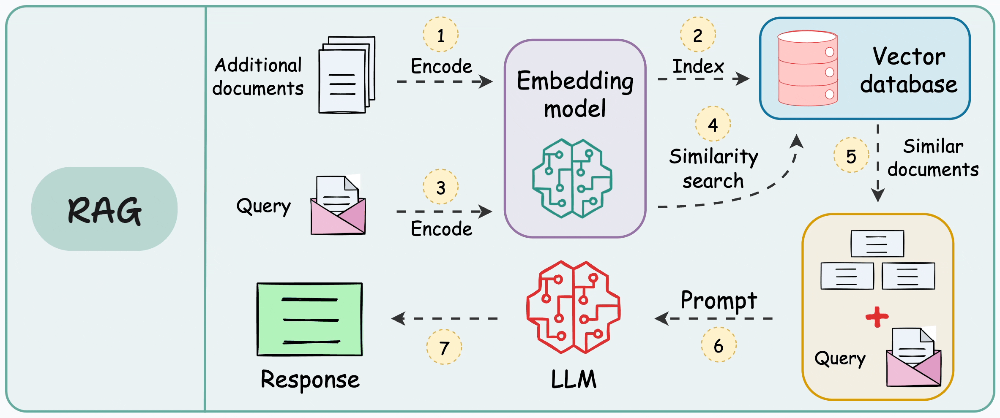
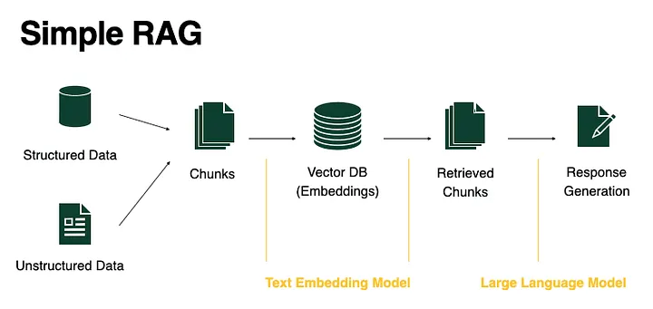
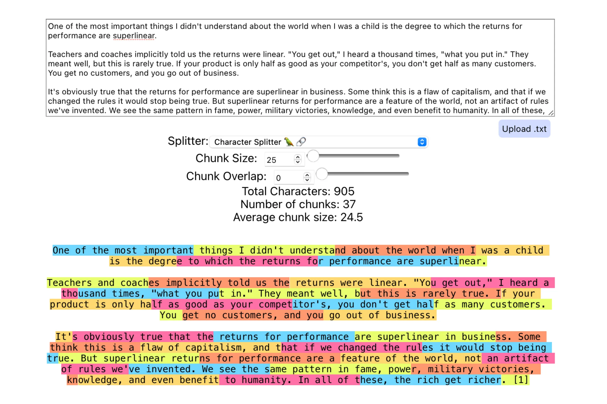
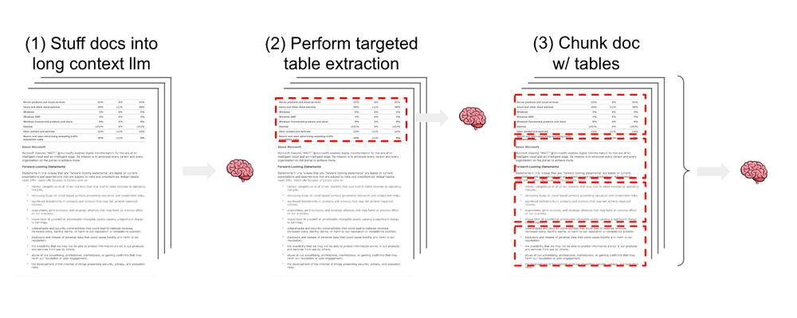
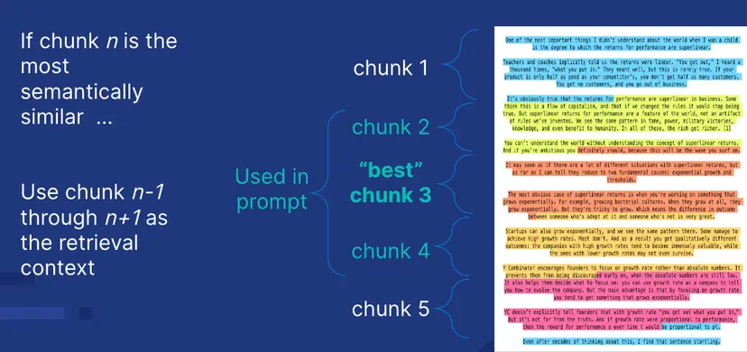

# unq_rag — Asistente de mantenimiento sobre documentación técnica

Sistema RAG multimodal que responde preguntas de mantenimiento industrial a partir de
manuales, planos eléctricos y tablas de especificaciones en PDF. Un operario pregunta
*"¿en qué bit veo si los parámetros están bloqueados en el PowerFlex 4M?"* y recibe la
respuesta con la tabla y la página del manual que la respaldan.

La diferencia con un RAG de documentos de texto es el material: la información que hace
falta está en tablas de parámetros, en diagramas de conexionado y en planos escaneados
sin capa de texto. Un pipeline que solo extrae párrafos no la encuentra.



---

## Los tres servicios

El repositorio contiene tres servicios que se despliegan por separado, cada uno con su
propio entorno virtual y su propio `.env`:

| Servicio | Qué hace | Stack | Puerto |
|---|---|---|---|
| **[Ingestion](Ingestion/)** | Convierte los PDF en un índice vectorial: extrae texto, tablas y figuras, los enriquece y los indexa | Python 3.12, PyMuPDF, ChromaDB, CLIP | — (proceso batch) |
| **[API](API/)** | Recibe la pregunta, recupera el contexto y genera la respuesta | Python 3.12, Flask, ChromaDB | 5000 |
| **[Frontend](Frontend/)** | Interfaz de chat con panel de fuentes y galería de figuras | React 19, TypeScript, Vite, Tailwind | 5173 |

El acoplamiento entre ellos es un directorio, no una API interna: **Ingestion** escribe el
índice y los recortes de media en `Ingestion/data/`, y **API** lee de ahí.

```
  PDFs                    Ingestion/data/                      navegador
   │                    ┌──────────────────┐                       ▲
   ▼                    │  chroma_index/   │                       │
┌───────────┐  escribe  │  media/          │  lee   ┌─────┐  HTTP  │
│ Ingestion │ ────────► │  chunks_data/    │ ◄───── │ API │ ◄──────┴── Frontend
└───────────┘           └──────────────────┘        └─────┘
   batch                                            :5000            :5173
```

---

## Cómo funciona

### El flujo estándar, y dónde se queda corto



El esquema de manual: partir los documentos en fragmentos, embeberlos, buscar los más
parecidos a la pregunta y pasárselos al modelo. Funciona con prosa. Con documentación
técnica se rompe en tres puntos, y cada uno tiene una respuesta concreta en este
repositorio.

### 1. El fragmento no puede cortarse por longitud



*Un splitter por caracteres sobre un texto cualquiera: los cortes caen a mitad de palabra
y a mitad de frase, sin mirar el contenido.*

Sobre un manual esto parte la fila de una tabla de su encabezado, y el fragmento
resultante dice `8448 | 11 | 1 = Parámetros bloqueados` sin decir de qué parámetro habla.

**Lo que hace Ingestion:** el troceado lo decide un modelo multimodal (`gpt-4o`) que ve
la página rasterizada, no el flujo de texto. Devuelve cada bloque con su tipo —texto,
tabla o figura— y cada tipo se procesa aparte. Las tablas conservan su markdown y su
estructura JSON; las figuras se recortan y se describen en una pasada dedicada de visión.
Los planos escaneados, que no tienen capa de texto, pasan por OCR con preprocesado
(deskew, binarización, 300 DPI) y por un filtro de legibilidad que descarta el ruido.

### 2. Las tablas necesitan un tratamiento propio



*Tres formas de tratar un documento con tablas: meterlo entero en un modelo de contexto
largo, extraer las tablas de forma dirigida, o trocear el documento respetándolas.*

Este proyecto usa la tercera. Una tabla grande se divide preservando el encabezado en
cada parte, y los chunks de tabla nunca se fusionan con los de texto vecinos: el
rechunking semántico solo agrupa contenido de tipo texto. Perder esa distinción fue un
bug real, y hay un test de regresión por cada uno de esos casos.

### 3. La pregunta y el manual no usan las mismas palabras

Un operario describe un síntoma —*"el variador no arranca desde el teclado"*— y el manual
describe una especificación. Los dos vectores no se parecen, por bien troceado que esté
el documento. Ingestion cierra esa distancia en el momento de indexar:

- **Contextual retrieval:** antepone a cada fragmento un contexto generado por LLM, para
  que el chunk no dependa de explicarse solo.
- **Preguntas sintéticas:** indexa vectores adicionales con las preguntas que ese
  fragmento responde, en el lenguaje del usuario.

Ambas encarecen la ingesta y se pueden apagar desde el `.env`.

### 4. El mejor fragmento rara vez basta



*Si el fragmento **n** es el más parecido a la pregunta, sus vecinos **n-1** y **n+1**
suelen contener el resto de la respuesta.*

Es la técnica que la API aplica en cada consulta (`USE_CONTEXT_EXPANSION`): un
procedimiento de puesta en marcha o una tabla partida en dos casi nunca caben en un solo
fragmento.

### El camino de una consulta

```
Frontend  ──POST /get_response──►  API
                                    │
                    ┌───────────────┼───────────────┐
                    ▼               ▼               ▼
              QueryIntent     ResponseCache    Retrieval denso
         reescribe el         coincidencia     Chroma + expansión
         follow-up como       exacta de la     de contexto
         pregunta autónoma    pregunta              │
                                                    ▼
                                          gate de similitud 0.50
                                                    │
                                                    ▼
                                          gpt-4.1 multimodal
                                          (contexto + planos)
                                                    │
   respuesta + fuentes + figuras  ◄──────────────────┘
```

Dos decisiones que no son las de manual y están documentadas en el código:

- **La caché es por texto exacto, no semántica.** Se midió la similitud entre pares de
  preguntas de este dominio y las bandas se solapan: *"corriente máxima de entrada"* vs
  *"de salida"* da 0.92, y dos redacciones de la misma pregunta dan 0.93. No hay umbral
  que las separe, y una falsa coincidencia devuelve el número de parámetro equivocado.
- **Tres técnicas de retrieval están apagadas tras medirlas.** Reranking con cross-encoder
  y BM25 no mejoran el recall en este corpus, y la búsqueda visual por CLIP tampoco; están
  implementadas y se activan con una flag, pero el default es `False`. Query expansion no
  llegó a implementarse porque el índice multi-vector ya cubre la paráfrasis.

---

## Puesta en marcha

**Requisitos:** Python 3.12, Node 20+, una API key de OpenAI y `tesseract` si vas a
procesar planos escaneados.

Cada servicio necesita su `.env`. Los `.env.example` documentan todas las variables:

```bash
cp API/.env.example API/.env
cp Ingestion/.env.example Ingestion/.env
cp Frontend/.env.example Frontend/.env
# y poner OPENAI_API_KEY en los dos primeros
```

### 1. Ingestion — construir el índice

```bash
cd Ingestion
python3.12 -m venv .venv && source .venv/bin/activate
pip install -r requirements.txt

cp tus_manuales/*.pdf data/raw_data/
python src/main_multimodal.py
```

Deja el índice en `data/chroma_index/` y los recortes de figuras y tablas en `data/media/`.
Es un proceso batch y cuesta dinero: cada página pasa por un modelo de visión, y el
enriquecimiento añade llamadas por chunk.

### 2. API — servir las respuestas

```bash
cd API
python3.12 -m venv .venv && source .venv/bin/activate
pip install -r requirements.txt
python app.py                      # http://localhost:5000
```

Lee el índice que dejó Ingestion. Sin `API_TOKEN` definido queda abierta, lo cual está
bien en local; para exponerla en una red hay que definir el token y acotar los orígenes:

```bash
CORS_ALLOWED_ORIGIN="http://ip-del-servidor:5173" API_TOKEN="..." python app.py
```

### 3. Frontend — la interfaz

```bash
cd Frontend
npm install
npm run dev                        # http://localhost:5173
```

---

## Tests

88 tests de invariantes, sin índice ni API key ni red. Cada uno corresponde a un bug que
llegó a producirse: si alguno se rompe, ese bug volvió.

```bash
./run_tests.sh
```

Para medir la calidad del retrieval hay además un set de evaluación de 59 preguntas con
respuesta y fuente conocidas, más 24 consultas visuales, en [Ingestion/eval/](Ingestion/eval/):

```bash
cd Ingestion && python eval/run_eval.py
```

---

## Estructura

```
├── Ingestion/          pipeline de ingesta
│   ├── src/tasks/          chunking → embeddings → indexado
│   ├── src/task_utils/     tablas, diagramas, OCR, enriquecimiento, validadores
│   ├── eval/               set de evaluación y scripts de medición
│   └── docs/              cómo funciona la ingesta, el camino de una pregunta
├── API/                servicio de consulta
│   ├── services/           orquestación del workflow RAG
│   ├── contexts/           acceso a Chroma y retrieval avanzado
│   └── qnas/               retriever y caché de respuestas
├── Frontend/           cliente web
└── run_tests.sh        ambas suites de tests
```

Cada servicio tiene su propio README con el detalle: [Ingestion](Ingestion/README.md)
documenta el pipeline y las mediciones detrás de cada decisión, y [API](API/README.md)
la configuración y el flujo de una consulta.
